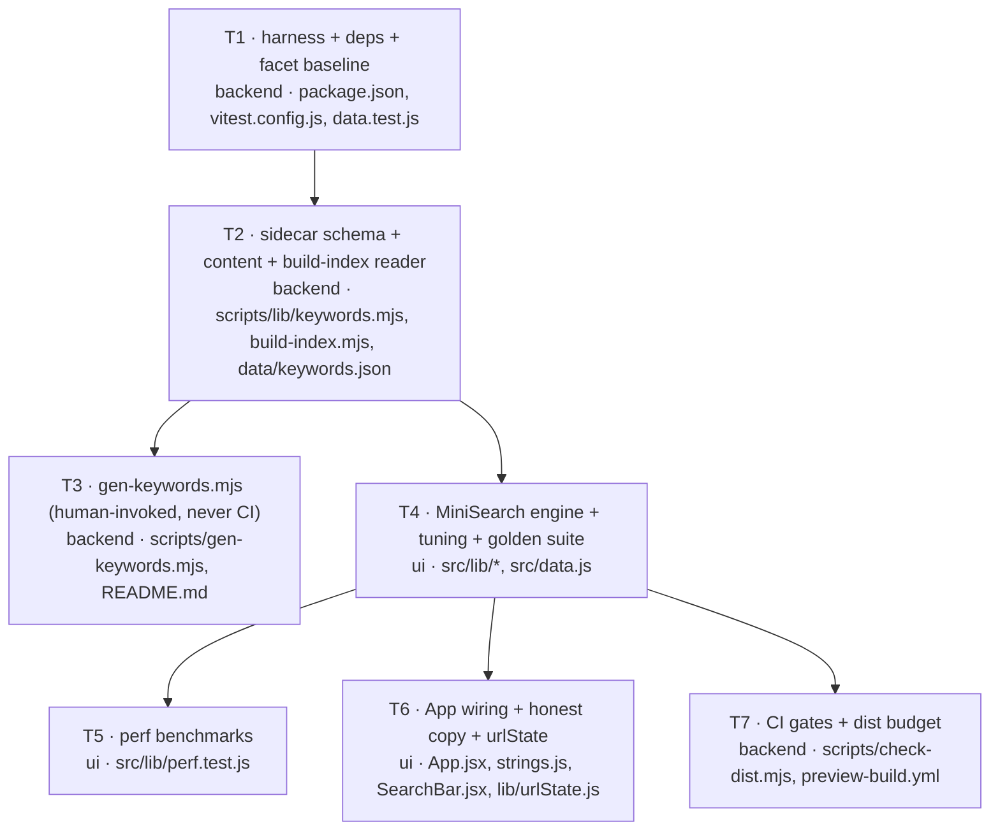

# Implementation Plan — SPEC-01 Lexical search engine + build-time keyword enrichment

- **Plan ID:** PLAN-01
- **Spec:** [`specs/preview/SPEC-01-2026-07-14-lexical-search-and-keyword-index.md`](../specs/preview/SPEC-01-2026-07-14-lexical-search-and-keyword-index.md) (Status: `approved`, 0 open NCs)
- **Module:** `preview`
- **Date:** 2026-07-14
- **Status:** approved — ready for `sdd-engineering:run-plan`
- **Owner:** RostK
- **Task units:** 7 (T1–T7) across 4 waves · **Execution: multi-agent**

> **Traceability.** All 30 `AC-N` ids are reused **verbatim** from SPEC-01, with their `Verify:` hints
> carried through. Every AC maps to ≥1 task unit and every task unit traces back to ≥1 AC — see the
> Acceptance criteria table. This is the forward pass `plan-verifier` consumes.

---

## Execution mode

**Multi-agent — ✅ confirmed by the owner (2026-07-14).**

The work decomposes into **7 units across 4 waves**, with genuine disjoint-file fan-out at two points
(T3 ‖ T4, then T5 ‖ T6 ‖ T7). T4 (the engine + tuning loop) is by far the fattest unit and benefits
from running while T3 (the generator script) proceeds independently. **Max concurrency 3.**

Each implementer runs **worktree-isolated** and touches only the files its unit names. The graph is
mostly linear (T1 → T2 → {T3, T4} → {T5, T6, T7}), so the parallelism win is real but moderate.

### Track mapping (explicit, per your note)
- `track: backend` = **Node build/tooling** — `preview/scripts/**`, `preview/data/**`, `.github/workflows/**`, `preview/package.json`, docs.
- `track: ui` = **React app** — `preview/src/**`.
- **`engineering-paved-path:onion-architecture` does not apply and was not invoked.** It is scoped to "Fastify modules plus a pure domain core… ports-in-shared / implementations-in-adapters / Container as composition root / Drizzle-only-in-repositories". There is no server, no DI container, no ORM here — invoking it would have produced guidance with no referent. The one structural idea worth borrowing (keep the pure logic free of the framework) is already enforced by `frontend-ui-architecture`'s `lib/` vs component split, which I did invoke. Flagging this as a deliberate, stated deviation rather than silently skipping it.

---

## Requirements review

### Understood requirements (restated from the spec — not newly authored)
1. Replace the hand-rolled substring matcher (`preview/src/lib/search.js`) with **MiniSearch v7.2.0** BM25 ranking; both `Smart`(→`Fuzzy`) and `Exact` become MiniSearch queries differing only in options. The `indexOf` matcher is **deleted** (§4.1, AC-14, AC-15).
2. Add an **invisible `keywords` ranking field**, generated **offline by a human-invoked local LLM script**, committed as a **sidecar under `preview/`**, read (never generated) by `build-index.mjs` (§4.2, AC-9, AC-19, AC-27).
3. **Warn, never fail** on keyword staleness via a stored per-artifact content hash (§4.3, AC-20).
4. Commit the **golden-query set as a relevance regression suite** that runs in CI and is the acceptance test for boost/length-norm tuning against `lucaong/minisearch#129` (§4.4, AC-7, AC-28).
5. Build the index **in the browser**, no `toJSON()` pre-serialization (§4.5, AC-29, AC-30).
6. Make the UI copy honest: `Fuzzy`/`Exact`, "semantic" gone, URL `mode=exact` value preserved (AC-17, AC-18).
7. Keep `tags` and everything tag-shaped **bit-identical** (NG-7, AC-13).

### Assumptions I had to make (all are HOW decisions the spec explicitly delegates)
- **A-P1. Test runner = Vitest + jsdom + React Testing Library.** The project is Vite 6 (`preview/vite.config.js:1-9`); Vitest is the Vite-native runner and the one the project's own `engineering-paved-path:react-testing-library` skill is written against ("General-purpose React Testing Library guide with **Vitest** … Applicable to any Vite + React project"). No competing constraint exists. Spec A-5 explicitly hands this choice to the plan.
- **A-P2. The corpus is real, not fixtured, for the golden suite.** AC-2 ("a term present in ≥20 of 29 documents") and AC-7/AC-11 are only meaningful against the actual 29-artifact catalog. Since `preview/src/catalog.json` is gitignored and generated (`preview/.gitignore:7`), the test script must be preceded by `npm run index` — hence a `pretest` hook (which runs the *indexer*, never the generator; AC-27-safe).
- **A-P3. Both modes are served by ONE MiniSearch index**, differing only in per-search options (`fields`, `combineWith`, `prefix`, `fuzzy`). This is what "one engine, one code path" (spec §6 preamble) means concretely.
- **A-P4. `Exact` now searches every field *except* `keywords`.** Today's `Exact` scans only `displayName`/`name`/`tags` (`search.js:22-24`). AC-15 says only "without searching the `keywords` field" — so `description`/`plugin`/`body` become searchable in Exact. **This is a deliberate behaviour change mandated by the AC**; the implementer must not "preserve" the old field restriction out of caution.
- **A-P5. The generator uses global `fetch` (Node 20) against the Anthropic Messages API — no SDK dependency.** Rationale: adding `@anthropic-ai/sdk` to `preview/package.json` would make CI's `npm ci` install an LLM SDK that is never invoked, enlarging the AC-27 surface for zero benefit. Both workflows pin `node-version: 20` (`preview-build.yml:46`, `pages.yml:43`), which has global `fetch`.

### Resolved decisions (owner-confirmed 2026-07-14 — **no open questions remain**)

The planner raised these as Q1–Q3 with recommended defaults. **The owner confirmed all three
recommendations.** They are now binding decisions, not options.

- **D1 (was Q1) — The T2 implementer authors the initial `preview/data/keywords.json` directly.** ✅
  It reads the corpus and writes the 29-artifact sidecar itself (it *is* an LLM; §4.2 requires only
  that "an LLM produces the keywords in a one-off local run, committed and hand-editable").
  `gen-keywords.mjs` still ships in T3 and is unit-tested with a **stubbed fetch**, so it is proven
  without ever being executed against the live API. **AC-9 and AC-11 must pass on this branch** — an
  empty sidecar is not an acceptable T2 outcome.

- **D2 (was Q2) — A committed `preview/dist-budget.json` holds the AC-21 baseline.** ✅
  `baselineGzipBytes` (measured once from `main`) + `maxDeltaBytes: 12288`. Deterministic, zero extra
  CI time, no network, no secret. **Someone must measure `main`'s gzipped bundle with the same
  summation function `check-dist.mjs` uses** — a baseline computed by a different method is
  worthless. T7 carries the procedure. Accepted cost: a maintainer must consciously refresh the
  baseline when an unrelated large change lands.

- **D3 (was Q3) — A stop-word-only query returns 0 results → the existing "No matches" empty
  state.** ✅ (E-2)
  This falls out naturally if `processTerm` drops stop-words at **both** index and query time (one
  hook, both directions) — no special-casing, and consistent with E-4. Rejected: treating it as an
  empty query, which conflates "you typed nothing" with "you typed only noise".

### Research needed
**None.** One item that *looks* like a research gap is not one, and must not be treated as one:

> The exact MiniSearch v7 option surface I rely on in T4 (`searchOptions.fields`, `combineWith`, function-form `prefix`/`fuzzy`/`boost`, `weights: { prefix, fuzzy }`, `bm25: { k, b, d }`, `processTerm` returning `null` to drop a term, `extractField` for array fields) is **not verifiable from this repo** — MiniSearch is not yet a dependency (`grep -c minisearch preview/package-lock.json` → 0). It is, however, **locally verifiable at implement time** from `preview/node_modules/minisearch/dist/*.d.ts` immediately after `npm i minisearch@7.2.0`. T4's definition of done therefore **requires reading the installed type definitions before wiring the config** — treat any option I named that isn't in the `.d.ts` as my error, not as a reason to guess.

### Recommendations (advice on the HOW — accept or reject)
- **R-1. Do the stemming with a ~15-line in-repo suffix normalizer, not a stemmer package.** G3/A-6 need "migrations" ≈ "migration". A Porter stemmer dep costs ~2 KB gzipped against a budget where MiniSearch alone is 5,814 B and the keyword data is new payload. Start hand-rolled (plural `-s`/`-es`, `-ing`, `-ed`, `-ies`→`-y`), tune against the golden set, and only reach for `stemmer` if a golden case *actually* fails. It lives in `searchConfig.js`, applied inside `processTerm` so index and query are stemmed by the *same* function (the classic way this breaks is stemming one side only).
- **R-2. Keep MiniSearch's default tokenizer; do all the work in `processTerm`.** E-3 (`/version-check`, `next.js`, `c++`) is *already* handled by the default non-word split: `/version-check` → `["version","check"]` at both index and query time. A custom tokenizer that "preserves the slash" would actively *break* E-3 by making the term `/version-check` unmatchable from a query typed without the slash. Do not write a custom `tokenize`.
- **R-3. Build the index lazily, and warm it after first paint.** `getEngine()` is a module-level memoized singleton in `search.js`; `App.jsx` calls it only when the query is non-empty, and warms it in a `useEffect` on mount. This satisfies AC-30 ("shall not block first paint") *structurally* rather than by benchmark luck, and it protects AC-22: without the warm-up, the very first keystroke would pay index-build (≤50 ms) + query inside the same 100 ms budget.
- **R-4. Solve E-10 at build time, not query time.** BM25 sums per-field contributions, so a term living in both `tags` and `keywords` genuinely double-counts. Strip, in `build-index.mjs`, any keyword whose normalized form already appears in `tags` or in the `displayName` tokens. One place, unit-testable, and it also shaves bundle bytes (AC-21).
- **R-5. Extract `parseHash`/`writeHash` from `App.jsx` into `preview/src/lib/urlState.js`.** They are module-private today (`App.jsx:21-45`), and AC-18's `Verify:` hint explicitly asks for a `parseHash`/`writeHash` **round-trip unit test**. Extracting is the smallest change that makes the AC testable as written, and it fits `frontend-ui-architecture`'s "business logic lives in `lib/`, not component bodies".
- **R-6. Watch the bundle math, don't assume the headroom is generous.** Budget accounting: `+5,814 B` (MiniSearch) `+ ~2–3 KB gz` (keywords ride *inside* the bundled `catalog.json` — `data.js:8` imports it) `+ ~0.3 KB` (stop-words + stemmer) `− ~1.5 KB gz` (deleting `haystack`, PI-2, `data.js:30`). Net ≈ **7–8 KB of the 12 KB ceiling**. That is headroom, not comfort: hold keywords to ~10–15 per artifact (not 20), and R-4's dedupe is a real byte saver. PI-2 is **not optional** in this plan — it is load-bearing for AC-21.
- **R-7. Skip PI-1/PI-3/PI-5** (autoSuggest, match-provenance, did-you-mean). NG-5 excludes them and PI-3 directly contradicts AC-13.

---

## Acceptance criteria (restated verbatim from the spec — traceability anchors)

Ids and `Verify:` hints carried through unchanged. Owning unit in the right column.

| AC | Statement (abridged — the spec is authoritative) | Verify | Unit(s) |
|---|---|---|---|
| **AC-1** | Multi-word Smart query with ≥1 matching term → non-empty ranked list (OR, never hard-AND empty) | unit — "how do I structure my React folders" returns ≥1 | T4 |
| **AC-2** | Smart results ranked by BM25-family score (TF × IDF × length-norm) over the 29-doc corpus | unit — a term in ≥20/29 docs contributes strictly less than a term in exactly 1 | T4 |
| **AC-3** | Prefix query term matches in Smart | unit — "postgre" returns `postgresql-table-design` in top 3 | T4 |
| **AC-4** | Query term within edit distance matches in Smart | unit — "fastfy best practices" returns `fastify-best-practices` top-1 | T4 |
| **AC-5** | Exact term match SHALL NOT rank below a fuzzy/prefix match, all else equal | unit — fixture with one exact + one edit-distance-1 match; assert ordering | T4 |
| **AC-6** | Per-field boosts: `displayName`/`name` hit outranks a `body`-only hit | unit — "zod" returns the `zod` skill top-1 | T4 |
| **AC-7** | Boosts + length-norm tuned so every golden case passes (issue #129) | unit — the golden-query regression suite | T4 |
| **AC-8** | Empty query → all artifacts, `newest` ordering (unchanged from `search.js:52`) | unit | T4 |
| **AC-9** | `build-index.mjs` reads the sidecar and emits `keywords: string[]` on all 29 artifacts, none empty | unit — `catalog.artifacts.every(a => a.keywords.length > 0)` | T2 |
| **AC-10** | `keywords` indexed in Smart with a boost **between** `tags` and `description` | unit + golden suite | T2 (emit) · T4 (boost) |
| **AC-11** | Synonym/problem-phrasing keyword query → artifact in top 3 | unit — "orm", "sql toolkit", "database migrations" each return `drizzle-orm-patterns` top 3 | T4 (golden) · T2 (content) |
| **AC-12** | All `keywords` values are English | manual review at PR time | T2 (content) · T3 (prompt constrains it) |
| **AC-13** | `keywords` alter no `tags`, facet, `?tag=`, badge, or count; never rendered | unit — snapshot `ALL_TAGS`/`TYPE_COUNTS`/`PLUGIN_COUNTS` before/after; e2e — no keyword string in the DOM | T1 (snapshot) · T2 (structural) · T6 (DOM) |
| **AC-14** | Fuzzy mode = `combineWith:'OR'` + prefix + fuzzy + `keywords` indexed, BM25-ranked | unit + manual | T4 |
| **AC-15** | Exact mode = `combineWith:'AND'`, no fuzzy, no prefix, no `keywords`, still BM25 | unit — "fastfy"→0; "fastify"→the skill; "sql toolkit"→0; BM25-ordered | T4 |
| **AC-16** | `Sort: Relevance` + non-empty query → BM25 desc **in both modes**, tie-break on `days` asc | unit | T4 |
| **AC-17** | Mode labels honest (`Fuzzy`/`Exact`); **"semantic" appears nowhere** in search copy; copy lives in `strings.js` | unit — `/semantic/i` matches nothing under `t.search`; manual copy review | T6 |
| **AC-18** | URL-hash contract preserved incl. the `mode=exact` **value** | unit — `parseHash`/`writeHash` round-trip; `#q=zod&mode=exact` opens literal mode | T6 |
| **AC-19** | Vocabulary in a single committed sidecar under `preview/`, keyed by artifact `id`, hand-editable | manual — `git ls-files`; a hand edit survives `npm run index` | T2 · T3 (README) |
| **AC-20** | Content-hash drift → **warning** naming the artifact, build **still exits 0** | integration — mutate a fixture's description, run indexer; warning + exit 0 + `catalog.json` written | T2 |
| **AC-21** | Bundle grows ≤ **12,288 B gzipped** vs current `main` | integration — CI compares gzipped size; fail on delta > 12,288 B | T7 |
| **AC-22** | Results within **100 ms** of the last keystroke (29 docs) | integration — timed benchmark over the golden set | T5 |
| **AC-23** | **Zero network requests at query time** | e2e — network panel while typing | T4/T6 (structural) · manual |
| **AC-24** | Query is untrusted data: never markup, never a regex, never persisted beyond the URL hash | unit — `` and `a.*(b\|c)+` → no error, no DOM injection | T4 · T6 |
| **AC-25** | Engine-init failure → full unfiltered list, facets still work, no crash | unit — force an engine-construction throw; `results.length === 29`, no unhandled error | T4 (fallback) · T6 (wiring) |
| **AC-26** | Search input keeps its `aria-label` + keyboard behaviour; no new mouse-only control | manual — keyboard walkthrough | T6 |
| **AC-27** | `build-index.mjs` never generates keywords / calls an LLM / hits the network; generation is a separate human-invoked script not run by `index`/`build`/`predev`/`prebuild`/CI | integration — full build offline, no key, deterministic on a 2nd run; manual — no CI workflow references a generation script or a secret | T2 · T3 (guard test) · T7 |
| **AC-28** | Golden set committed as a regression suite that **runs in CI**; ≥1 sentence query, ≥1 keyword-only query | unit — suite runs & passes in CI; asserts both kinds present | T4 (suite) · T7 (CI) |
| **AC-29** | Index built in the browser; **no** pre-serialized index shipped or emitted | integration — no serialized-index asset in `preview/dist`; unit — engine constructed from the catalog at runtime | T4 (design) · T7 (dist gate) |
| **AC-30** | Index construction ≤ **50 ms**, and **does not block first paint** | integration — timed benchmark; e2e — first paint precedes first answerable query | T5 (bench) · T6 (non-blocking wiring) |

---

## Non-functional requirements — these shape the design, not just the tests

| NFR | Design consequence (assigned, not just asserted) |
|---|---|
| **AC-21 · ≤12 KB gzipped** | Forces **PI-2 (delete `haystack`, `data.js:30`) into scope**, caps keywords at ~10–15/artifact, makes R-4's dedupe a byte saver, and **rules out a stemmer package** in favour of R-1's in-repo normalizer. Gated in CI by T7. |
| **AC-22 · ≤100 ms as-you-type** | Drives R-3's **post-paint index warm-up** — otherwise the first keystroke pays index-build inside the same budget. Also drives E-6's "query the full corpus once, then facet-filter" ordering (memoized on `q`+`mode`, so toggling a facet does not re-query). |
| **AC-23 · zero network at query time** | Structurally guaranteed, not merely tested: the catalog is `import`ed (`data.js:8` — bundled, per `LEARNINGS.md:18`) and MiniSearch is bundled. **Invariant for T4/T6: no `fetch`/`XMLHttpRequest`/dynamic `import()` may enter the search path.** |
| **AC-24 · untrusted query** | The query is passed to MiniSearch **as a string only**. Hard bans, straight from the security skill: no `new RegExp(userQuery)` anywhere (ReDoS + injection), no `dangerouslySetInnerHTML`, no persistence beyond the existing URL hash. React's JSX escaping is the safety net for rendering — do not defeat it. Owned by T4 (engine) and T6 (render path). |
| **AC-25 · graceful engine-init failure** | `getEngine()` wraps construction in `try/catch` and returns `null`; `computeResults(data, state, engine)` treats `engine === null` as "no query stage" — facets still applied, sort falls back to `newest`. **Fail-open is correct here** (this is a search box, not an authz gate). Owned by T4; wired by T6. |
| **AC-26 · a11y** | `aria-label={t.search.ariaLabel}` (`SearchBar.jsx:15`) is preserved verbatim. The mode toggle buttons (`SearchBar.jsx:20-25`) are real `<button>`s and stay so. **No new control is introduced by this change** — relabelling only. |
| **AC-30 · ≤50 ms index build, non-blocking** | R-3's lazy singleton + `useEffect` warm-up. Benchmarked by T5. |
| **English-only (A-7, user memory)** | Every new string goes in `preview/src/strings.js`; keywords are English (AC-12). No hardcoded copy in components. |
| **Privacy / secrets (AC-27, A-4)** | `ANTHROPIC_API_KEY` is read from `process.env` in `gen-keywords.mjs` **only**, never committed, never referenced by any workflow. CI keeps `permissions: contents: read` (`preview-build.yml:26`) and gains **no secret and no network step**. T3 ships a guard test that fails if a workflow or an npm script ever references the generator. |

---

## Scope

**Modules touched**
- `preview/src/lib/` — `search.js` (rewrite), `searchConfig.js` (new), `urlState.js` (new), `golden-queries.js` (new), tests
- `preview/src/` — `data.js`, `App.jsx`, `strings.js`, `components/SearchBar.jsx`, `test-setup.js` (new)
- `preview/scripts/` — `build-index.mjs`, `lib/keywords.mjs` (new), `gen-keywords.mjs` (new), `check-dist.mjs` (new)
- `preview/` — `package.json`, `package-lock.json`, `vitest.config.js` (new), `data/keywords.json` (new), `dist-budget.json` (new), `README.md`, `LEARNINGS.md`
- `.github/workflows/preview-build.yml`
- `docs/SPEC-marketplace-ui.md` (supersede pointer only)

**Modules deliberately NOT touched** (so no worker drifts into them)
- **`plugins/**` — untouched.** The sidecar decision keeps the shipped product out of the blast radius. No frontmatter key named `keywords` may be introduced anywhere: `tagsFor()` reads `fm.tags || fm.keywords` (`build-index.mjs:81`), so it would silently become an artifact's *tags*.
- `preview/src/components/{Card,Filters,DetailModal,Header,Toast,InstallToggle,WhatsNew}.jsx` — tag rendering is frozen by AC-13/NG-7.
- `preview/src/index.css`, `icons.jsx`, `main.jsx`.
- `.github/workflows/pages.yml` — the deploy path gains nothing; the gate lives in `preview-build.yml` (AC-21/AC-28). *(If you want the budget enforced on `main` pushes too, that is a one-line follow-up.)*
- `preview/scripts/gen-favicons.mjs`, `scripts/*.sh`.
- **`docs/SPEC-marketplace-ui.md` — ALREADY DONE (`ed456af`), do not touch.** See the struck-through T8 above.

**Contracts changed**
- `catalog.json` artifact shape gains **`keywords: string[]`** — produced by `build-index.mjs`, consumed by `search.js`. There is **one** producer and **one** consumer, no vendored copies, no duplicate schema. `data.js`'s spread (`...a`, `data.js:28`) carries it through for free.
- `computeResults(data, state)` → **`computeResults(data, state, engine)`**. One caller (`App.jsx:91`).
- `preview/data/keywords.json` — **new committed contract, pinned here** (Gap 3 in the brief):

```jsonc
{
  "schemaVersion": 1,
  "generatedAt": "2026-07-14T00:00:00.000Z",
  "artifacts": {
    // key = artifact `id` exactly as build-index.mjs mints it:
    //   `${pluginName}/${type}/${name}`  (build-index.mjs:114, 136, 158, 180)
    //   note the command's name carries its leading slash → ".../command//version-check"
    "engineering-paved-path/skill/drizzle-orm-patterns": {
      "keywords": ["orm", "sql toolkit", "database migrations", "query builder", "..."],
      "contentHash": "sha256:9f2c…",     // see below — the ONE hash definition
      "generatedAt": "2026-07-14T00:00:00.000Z"
    }
  }
}
```

**The content hash is defined once, in one module, and both writers use it** — this is the single most breakable thing in the design:
`contentHashOf(a) = sha256( a.displayName + "\n" + a.description + "\n" + a.body )`, exported from `preview/scripts/lib/keywords.mjs` and imported by **both** `build-index.mjs` (compare) and `gen-keywords.mjs` (write). It **must exclude `updatedAt`/`gitDate`** — that changes on every commit touching the file, which would make every artifact permanently "stale" and turn AC-20's warning into unreadable noise. It excludes `tags` too (NG-7: tags and keywords are independent).

---

## Task units

### [T1] Test harness, dependencies, and the AC-13 facet baseline · track: backend · parallel-group: A

- **Files**
  - `preview/package.json` — modify: add dependency `minisearch@7.2.0`; devDependencies `vitest`, `@testing-library/react`, `@testing-library/user-event`, `@testing-library/jest-dom`, `jsdom`. Add scripts: `"test": "vitest run"`, `"pretest": "npm run index"`, `"test:watch": "vitest"`, `"check:dist": "node scripts/check-dist.mjs"`. **Add NO script that references `gen-keywords`** (AC-27, belt-and-braces — T3 ships a test that enforces this).
  - `preview/package-lock.json` — modify (via `npm install`; commit it — CI runs `npm ci`, `preview-build.yml:51`).
  - `preview/vitest.config.js` — create: `plugins: [react()]` (a standalone vitest config does **not** inherit `vite.config.js`'s plugins, so JSX would not transform without this); `test.environment: 'node'` as the default, with DOM tests opting in per-file via `// @vitest-environment jsdom`; `setupFiles: ['./src/test-setup.js']`; `include: ['src/**/*.test.{js,jsx}', 'scripts/**/*.test.mjs']`.
  - `preview/src/test-setup.js` — create: `@testing-library/jest-dom` + RTL auto-cleanup.
  - `preview/src/data.test.js` — create: the **AC-13 baseline** — explicit (not auto-snapshot) assertions on `ALL_TAGS`, `TYPE_COUNTS`, `PLUGIN_COUNTS` (`data.js:52-58`), plus `DATA.length === 29`. Hand-written expected values so the diff is reviewable in a PR.
- **Skills to apply**: `engineering-paved-path:react-testing-library` (harness setup), `engineering-paved-path:typescript-expert` (ESM/JS, npm scripts), `engineering-paved-path:frontend-ui-architecture` (file placement).
- **Known pitfalls**
  - *"`src/catalog.json` is generated and gitignored … you cannot hand-author data into it (re-run `npm run index` instead)"* — `preview/LEARNINGS.md:18`, `preview/.gitignore:7`. **Therefore `pretest` must run `npm run index`**, or every test importing `data.js` explodes on a clean checkout / in CI.
  - `preview/README.md:48` claims `src/lib/` contains `markdown.js` — **it does not** (only `search.js`). The README is already stale; do not trust it as a map.
  - `check:dist` is registered here but the script itself lands in **T7** — deliberate, to keep `package.json` owned by exactly one unit. Between T1 and T7, `npm run check:dist` will fail with "module not found"; that is expected and is not a T1 defect.
- **Definition of done**: `npm test` runs, `preview/src/data.test.js` passes on a clean checkout (proving `pretest` → `npm run index` → catalog exists), `npm run build` still succeeds.
- **Depends on**: none.
- **ACs**: AC-13 (baseline half); enables every `Verify: unit`/`integration` AC.

---

### [T2] Keyword sidecar: schema, content, `build-index.mjs` reader + staleness warning · track: backend · parallel-group: B

- **Files**
  - `preview/scripts/lib/keywords.mjs` — create. Exports: `SCHEMA_VERSION`, `KEYWORDS_PATH`, `readSidecar()` (tolerates a missing file → empty map + one warning), `contentHashOf({displayName, description, body})` (the single hash definition above), `attachKeywords(artifacts, sidecar) → { artifacts, warnings }` — **pure, fs-free, therefore unit-testable without touching the repo**.
  - `preview/scripts/build-index.mjs` — modify. After the artifact loop (currently ends line 195), call `attachKeywords`, `console.warn` each warning, and **never** `process.exit(1)`. Keep the existing summary log (`:213-216`).
  - `preview/data/keywords.json` — create: ~10–15 English keywords per artifact for **all 29** (per **Q1**, authored directly by this unit). **Must include** the golden-set vocabulary gap: `drizzle-orm-patterns` needs `"orm"`, `"sql toolkit"`, `"database migrations"` (AC-11), and `pr-self-review` needs the "check my code before pushing" problem-phrasing (golden case 5).
  - `preview/scripts/lib/keywords.test.mjs` — create: hash stability + hash-excludes-`updatedAt`; drift → warning naming the artifact (**AC-20**); missing-entry → warning, not throw; **E-10** dedupe; **E-9** empty `body` does not throw; **AC-9** every artifact in the real generated catalog has ≥1 keyword.
  - `preview/scripts/build-index.it.test.mjs` — create: spawn `node scripts/build-index.mjs` for real → **exit code 0**, `catalog.json` written, `keywords` present on 29 artifacts, `ALL_TAGS`-relevant `tags` byte-identical to the pre-change baseline (AC-13), and **deterministic across two runs** (AC-27).
- **Skills to apply**: `engineering-paved-path:typescript-expert`, `engineering-paved-path:zod` *(only if the implementer wants a schema guard on the sidecar — optional; a hand-rolled validator is fine and adds no dependency to the bundle)*, `engineering-paved-path:security` (LLM output is **data, never instructions**; the sidecar is parsed with `JSON.parse` inside `try/catch` — a malformed file warns, it must not crash the build).
- **Known pitfalls**
  - *"`tagsFor()` reads `fm.tags || fm.keywords`, so a frontmatter key literally named `keywords` is **already consumed as an artifact's tags** and will silently pollute the tag facet"* — `preview/LEARNINGS.md:17`, `build-index.mjs:81`. **The sidecar exists precisely to sidestep this. Never add a `keywords` frontmatter key.**
  - **`catalog.generatedAt` is `new Date().toISOString()` (`build-index.mjs:202`)** — it changes on every run. The AC-27 determinism assertion **must exclude it**, or the integration test fails 100% of the time. Same trap for `updatedAt` (git date) if git state moves.
  - The command artifact's `id` is `architecture-review/command//version-check` — **a double slash**, because `name` is prefixed with `/` at `build-index.mjs:182`. It is a valid JSON key; do not "fix" it, and do not build ids by string-splitting on `/`.
  - **E-10**: strip any keyword whose normalized form equals an existing `tag` or a `displayName` token — BM25 sums field contributions, so a duplicate genuinely double-counts (R-4). Guard: the strip must not empty an array (AC-9).
- **Definition of done**: `npm run index` prints the 29-artifact summary **and exits 0** even with a deliberately drifted hash, while naming the drifted artifact; `keywords.test.mjs` + `build-index.it.test.mjs` pass; `ALL_TAGS`/`TYPE_COUNTS`/`PLUGIN_COUNTS` still match T1's baseline.
- **Depends on**: T1.
- **ACs**: AC-9, AC-10 (emit half), AC-12, AC-13 (structural), AC-19, AC-20, AC-27 (indexer half). Edge cases: **E-9, E-10**.

---

### ~~[T8] Supersede pointer in the legacy spec~~ — ✅ **ALREADY DONE, NOT A TASK UNIT**

> The planner proposed this unit, unaware it had already been completed. **`docs/SPEC-marketplace-ui.md`
> was superseded and committed in `ed456af` (2026-07-14), before this plan was written.**
>
> It went further than the planner scoped: the embeddings design spanned far more of that document
> than §5.2/§5.3/§6 — it also lived in §1 (scope + constraints), the §2 architecture diagram, §3.2
> (`embeddings.json`), §4 step 3 (`embed.mjs`), §8 (which still budgeted a **25–90 MB MiniLM
> download**), §10 (milestone M3) and §11 (open questions 1–2). Every affected section is now marked
> inline, original text struck through and kept as history. §5.1 is marked ✅ **survives** — it picked
> MiniSearch, which the research vindicated.
>
> **No implementer may touch `docs/SPEC-marketplace-ui.md`.** It is done. The file is listed under
> "Modules deliberately NOT touched" below.

---

### [T3] Human-invoked keyword generator (the only LLM caller; never in CI) · track: backend · parallel-group: C

- **Files**
  - `preview/scripts/gen-keywords.mjs` — create. Reads `preview/src/catalog.json` (so it requires a prior `npm run index` — it must say so and exit non-zero with a clear message if the catalog is absent). Calls the Anthropic Messages API via **global `fetch`** (Node 20; no SDK dependency — see A-P5) with `process.env.ANTHROPIC_API_KEY`; **refuses to run** if the key is absent. Writes `preview/data/keywords.json` through `keywords.mjs` (schema + `contentHashOf`). Flags: `--dry-run` (print, write nothing), `--only <id>` (regenerate one artifact), `--stale` (only artifacts whose hash drifted). Prints a human-readable diff summary so the maintainer sees what changed before committing.
  - `preview/scripts/gen-keywords.test.mjs` — create. **This is the AC-27 enforcement, and it is the highest-value test in the unit:**
    1. `preview/package.json` contains **no** script whose value references `gen-keywords`;
    2. **no** file under `.github/workflows/**` references `gen-keywords`, `ANTHROPIC`, or `secrets.`;
    3. `build-index.mjs`'s source contains no `fetch`/`http`/`https` import and does not import `gen-keywords.mjs`;
    4. with a **stubbed `fetch`** (no network), a canned model response maps correctly onto the sidecar schema, and a malformed response is rejected rather than written.
  - `preview/README.md` — modify: a "Search keywords" section — what the sidecar is, that it is **hand-editable** (AC-19), how to regenerate (`ANTHROPIC_API_KEY=… node scripts/gen-keywords.mjs`), that it is **never** run by the build or CI, and what the staleness warning means. Also fix the stale `src/lib/` structure block (`README.md:48`) and add the `npm test` command.
- **Skills to apply**: **`claude-api`** — *the implementer MUST read this skill and take the model id, endpoint, and request shape from it. **Do not guess a model id from memory.*** Also `engineering-paved-path:security` (API key from `process.env` only, never committed, never logged; the model's output is **data**, and it lands in a committed file a human reviews before it can ever reach a build — §10), `engineering-paved-path:typescript-expert`.
- **Known pitfalls**
  - *"CI grants `permissions: contents: read` and references **no secrets** … a build-time network/LLM call is not possible today"* — `preview/LEARNINGS.md:19`, `preview-build.yml:26`, `pages.yml:17`. **Keep it that way.** The generator must remain invisible to CI.
  - **npm lifecycle trap**: naming an npm script `X` makes npm auto-run a script named `preX`. Since the plan adds **no** generator script at all, this cannot bite — but if someone later adds one, it must not be named such that an existing lifecycle hook picks it up. The guard test (2) above is the durable defence.
  - The generator writes the file **T2 owns as a source artifact**. That is fine and intentional (T2 commits the content; T3 ships the tool that can reproduce it), but it means **T3 must not run the generator during implementation** — no API key, no network. Its correctness is proven by the stubbed-fetch test.
- **Definition of done**: `node scripts/gen-keywords.mjs --dry-run` with no key exits with a clear error and writes nothing; the four guard assertions pass; the README explains the whole loop to a maintainer who has never seen it.
- **Depends on**: T2 (imports `keywords.mjs`, writes its schema).
- **ACs**: AC-12, AC-19, AC-27.

---

### [T4] MiniSearch engine, tuning config, and the golden-query regression suite · track: ui · parallel-group: C

*The core unit. It owns the tune-until-green loop, so the golden suite lives here — AC-7 makes the golden set the acceptance test for tuning, and you cannot tune against a suite another agent owns.*

- **Files**
  - `preview/src/lib/searchConfig.js` — create. The single tuning surface: `FIELDS`, `BOOSTS` (**AC-6 + AC-10 ordering: `displayName`/`name` > `tags` > `keywords` > `description` ≈ `plugin` > `body`** — `keywords` strictly between `tags` and `description`), `BM25 = { k, b, d }` (**start from MiniSearch's `b: 0.7` and lower it — `b` *is* the field-length-normalization strength, and it is the direct lever on issue #129**), function-form `prefix: (t) => t.length >= 3` and `fuzzy: (t) => t.length >= 4 && 0.2` (**E-1**), `weights: { prefix, fuzzy }` (**AC-5** — exact must beat expanded), `STOP_WORDS` (**E-2** — MiniSearch ships none), `normalizeTerm()` (lowercase → strip punctuation → drop stop-word → light stemmer, R-1), and `MODE_OPTIONS.smart` / `MODE_OPTIONS.exact`.
  - `preview/src/lib/search.js` — **rewrite**. Delete `score()` and `matchesQuery()` entirely (`search.js:3-31` — the additive table and the hard-AND at line 28 both go). Export `createEngine(data)`, `getEngine()` (module-level memoized singleton, `try/catch` → `null` on failure, **AC-25**), and `computeResults(data, state, engine)` — which queries once over the **full** corpus (memoized on `q`+`mode`), then applies facet filters to the ranked ids (**E-6**: ranking stays stable when a facet is toggled), then sorts (**AC-16** BM25 desc, tie-break `days` asc; **AC-8** empty query → `newest`, preserving today's `search.js:52` fallback).
  - `preview/src/data.js` — modify: **delete the `haystack` field** (`data.js:30`) — dead once MiniSearch indexes fields directly (PI-2), and load-bearing for AC-21. Everything else in the file is untouched (AC-13).
  - `preview/src/lib/golden-queries.js` — create: the 5 seed cases from §4.4 as **data**, each tagged `kind: 'sentence' | 'keyword-only' | 'typo' | 'lexical' | 'problem-phrasing'` and `expect: { top1 | top3 }`. Kept as a plain module so a maintainer can extend it without touching test code (§4.4: "explicitly extensible").
  - `preview/src/lib/search.test.js` — create: AC-1, AC-2, AC-3, AC-4, AC-5, AC-6, AC-8, AC-14, AC-15, AC-16, AC-24, AC-25; **E-4** (zero matches), **E-5** (term in every doc), **E-6** (facet+query), **E-7** (pasted paragraph), **E-8** (mixed case / Unicode).
  - `preview/src/lib/searchConfig.test.js` — create: **E-1** (single char + prefix), **E-2** (stop-word-only → per Q3, 0 results), **E-3** (`/version-check`, `next.js`, `c++` tokenize identically at index and query time), stemming (`migrations` ≈ `migration`).
  - `preview/src/lib/golden.test.js` — create: **AC-7** (every golden case passes), **AC-11**, **AC-28** (assert the set contains ≥1 `sentence` and ≥1 `keyword-only` case).
- **Skills to apply**: `engineering-paved-path:frontend-ui-architecture` (**`lib/` = the stateful integration — the MiniSearch client belongs here, framework-free; no React import in this unit**), `engineering-paved-path:typescript-expert`, `engineering-paved-path:security` (**AC-24: the query is a string passed to MiniSearch — never `new RegExp(query)`; ReDoS and injection both die there**), `engineering-paved-path:react-testing-library` (test idiom; these are node-env tests).
- **Known pitfalls**
  - **Verify the MiniSearch API against `preview/node_modules/minisearch/dist/*.d.ts` before wiring the config.** MiniSearch is not yet a dependency here, so every option I named (`searchOptions.fields`, `combineWith`, function-form `prefix`/`fuzzy`/`boost`, `weights`, `bm25`, `processTerm` returning `null` to drop a term, `extractField`) is from the v7 docs and **unverified in-repo**. Trust the `.d.ts`, not this plan.
  - *"field-length normalization … can **dominate IDF**, letting a very short document outrank a longer, more relevant one. This bites this codebase specifically because artifact titles are short and descriptions are long — field boosts must be tuned and regression-tested, not left at defaults"* — `preview/LEARNINGS.md:29`, spec §4.1. **Tune `b` and the boosts until the golden suite is green. That loop is the unit's real work.**
  - **`tags` and `keywords` are arrays.** MiniSearch needs an `extractField` that joins them; a naive config indexes `"[object Object]"`-ish junk or nothing at all, and the failure is silent — the query just never matches. Assert a tag-only query works.
  - **`processTerm` runs at both index and query time.** That is the feature (stemming and stop-words must be symmetric, or nothing matches), and it is also the trap — an asymmetric hook is the single likeliest cause of "everything mysteriously returns zero".
  - **Do not write a custom `tokenize`** (R-2). The default non-word split already makes `/version-check` findable; a slash-preserving tokenizer would *break* E-3.
  - **E-9**: `body: a.body || ""` — do not let an empty body drop an artifact from the index or divide by zero in the length norm.
  - **A-P4**: `Exact` now searches all fields except `keywords`. Do not "preserve" the old `displayName`/`name`/`tags`-only restriction (`search.js:22-24`) — AC-15 supersedes it.
- **Definition of done**: `npm test` green including **all 5 golden cases**; `search.js` contains no `indexOf` matcher and no `score()`; `haystack` is gone from `data.js`; no `fetch`/`RegExp(userInput)` anywhere in the search path; a forced construction throw yields 29 results.
- **Depends on**: T1, T2 (needs `keywords` in the catalog for AC-10/AC-11).
- **ACs**: AC-1…AC-8, AC-10 (boost half), AC-11, AC-14, AC-15, AC-16, AC-23 (structural), AC-24, AC-25 (fallback), AC-28 (suite), AC-29 (design). Edge cases: **E-1…E-10** (engine side).

---

### [T5] Performance benchmarks · track: ui · parallel-group: D

- **Files**
  - `preview/src/lib/perf.test.js` — create: **AC-30** — index construction over the real 29-doc corpus completes in **< 50 ms** (median of N runs, not a single sample — CI runners are noisy). **AC-22** — for every golden query, replay it *as-you-type* (each successive prefix of the query string) and assert each result computation lands in **< 100 ms**. **E-7** — a pasted-paragraph query stays inside the budget.
- **Skills to apply**: `engineering-paved-path:typescript-expert`.
- **Known pitfalls**
  - **A wall-clock assertion on a shared CI runner is a flake generator.** Use a median/p90 over ≥5 iterations, warm the engine before timing the query (that is what production does — R-3), and set the threshold to the AC value, not tighter. If it proves flaky, the honest fix is to keep the assertion and widen the sample — **not** to delete the AC.
  - Import `golden-queries.js` **read-only**. This unit must not edit it or `searchConfig.js`, or it collides with T4.
- **Definition of done**: both budgets asserted and green locally and in CI.
- **Depends on**: T4.
- **ACs**: AC-22, AC-30 (benchmark half).

---

### [T6] React wiring, honest copy, URL-hash contract · track: ui · parallel-group: D

- **Files**
  - `preview/src/lib/urlState.js` — create: `parseHash`, `writeHash`, `SORTS`, moved verbatim from `App.jsx:15-45` and **exported** so AC-18's round-trip test can exist (R-5). Behaviour-preserving move: `mode=exact` stays the wire value, `smart` stays the default (`App.jsx:24`, `:37`).
  - `preview/src/App.jsx` — modify: import `parseHash`/`writeHash` from `lib/urlState.js`; get the engine via `getEngine()` **only when the query is non-empty**, and warm it in a `useEffect` on mount so it is ready before the first keystroke (**AC-30 non-blocking, AC-22 headroom** — R-3); pass it to `computeResults(DATA, state, engine)` (`App.jsx:91`). **No other change** — facets, sort dropdown, modal, What's New, toasts all stay as they are.
  - `preview/src/strings.js` — modify: **AC-17** — `t.search.smart: "Smart"` → `"Fuzzy"`; `t.search.modeHint: "Smart = semantic ranking · Exact = keyword only"` (`strings.js:26`) → an honest line, e.g. `"Fuzzy = typo-tolerant, ranked · Exact = literal, ranked"`. **The word "semantic" must not survive anywhere under `t.search`.** English only.
  - `preview/src/components/SearchBar.jsx` — modify: the button label reads the renamed string (`SearchBar.jsx:21`). **The `mode` *value* stays `"smart"`** — AC-18 protects the URL param, not the label. Keep `aria-label={t.search.ariaLabel}` (`SearchBar.jsx:15`) byte-identical (**AC-26**).
  - `preview/src/strings.test.js` — create: **AC-17** — `/semantic/i` matches nothing under `t.search`; no empty strings; all copy is ASCII-English.
  - `preview/src/App.test.jsx` — create (`// @vitest-environment jsdom`): **AC-18** (`parseHash`/`writeHash` round-trip; `#q=zod&mode=exact` opens the literal mode); **AC-13** (render with a query and assert **no keyword string appears in the DOM**, and the tag chips/badges are unchanged); **AC-24** (`` and `a.*(b|c)+` → no throw, no injected node); **AC-25** (mock `getEngine` to throw → 29 cards render, facets still work); **AC-26** (the input's accessible name is intact; the mode toggle is keyboard-reachable); **E-4** (the "No matches" empty state still renders).
- **Skills to apply**: `engineering-paved-path:react-best-practices` (hooks, memo, no logic in the component body), `engineering-paved-path:react-testing-library` (query priority, `userEvent`), `engineering-paved-path:frontend-ui-architecture` (`parseHash`/`writeHash` belong in `lib/`, not a component; **URL-owned state stays in the URL**), `engineering-paved-path:security` (**no `dangerouslySetInnerHTML`; React's JSX escaping is the AC-24 safety net — do not defeat it**).
- **Known pitfalls**
  - *"the UI strings in this app have drifted ahead of what the code does, so treat user-facing copy as a claim to verify, not as documentation"* — `preview/LEARNINGS.md:37`. This unit is the one that pays that debt off. **Grep the whole `preview/src/` tree for "semantic", not just `strings.js`.**
  - **AC-18 is the sharpest trap in the plan**: renaming the label `Smart` → `Fuzzy` must **not** rename the state value or the URL param. `parseHash` (`App.jsx:24`) and `writeHash` (`App.jsx:37`) both hard-code `"smart"`/`"exact"`. Old shared links (`#q=zod&mode=exact`) must keep working. If a worker "helpfully" renames the value to `fuzzy`, every shared link silently changes meaning.
  - Moving `parseHash`/`writeHash` must be **behaviour-preserving** — including `writeHash`'s "omit the default" logic (`App.jsx:36-38`) and the `location.pathname + location.search` reset when the hash is empty (`App.jsx:44`).
  - The engine warm-up `useEffect` must be idempotent and must not set state (nothing to re-render) — it exists purely to populate the memoized singleton.
- **Definition of done**: `npm test` green; the app builds and runs; `#q=zod&mode=exact` still opens the literal mode; no "semantic" anywhere in `preview/src/`; a forced engine throw renders all 29 cards with working facets.
- **Depends on**: T4 (`computeResults` signature, `getEngine`).
- **ACs**: AC-13 (DOM half), AC-17, AC-18, AC-23 (render path), AC-24, AC-25 (wiring), AC-26, AC-30 (non-blocking half). Edge case: **E-4**.

---

### [T7] CI gates: golden suite + gzipped bundle budget + no-serialized-index · track: backend · parallel-group: D

- **Files**
  - `preview/scripts/check-dist.mjs` — create: the **post-build dist gate**. (a) Sum the **gzipped** bytes of every emitted asset in `preview/dist` (`assets/*.js`, `assets/*.css`, `index.html`); compare against `dist-budget.json`; **exit 1** if `total − baselineGzipBytes > maxDeltaBytes` (**AC-21**), printing the delta either way. (b) Assert **no pre-serialized search-index asset** exists in `dist` (**AC-29**). Cohesive: one script, one concern — "is the shipped `dist` within contract".
  - `preview/dist-budget.json` — create: `{ "baselineGzipBytes": <measured from main>, "maxDeltaBytes": 12288, "measuredFrom": "<main sha>", "note": "..." }`.
  - `preview/scripts/check-dist.test.mjs` — create: unit-test the gzip summation and the pass/fail boundary against fixtures (do **not** require a real build to test the arithmetic).
  - `.github/workflows/preview-build.yml` — modify: after `- name: Build` (`:53-54`), add `- name: Test` (`npm test` — **AC-28: the golden suite runs on every CI build**) and `- name: Check dist budget` (`npm run check:dist` — AC-21, AC-29). **`permissions: contents: read` (`:26`) is unchanged. No secret. No network step. No reference to any generation script** (AC-27).
- **Skills to apply**: `engineering-paved-path:typescript-expert`, `engineering-paved-path:security` (CI stays secret-free and offline).
- **Known pitfalls**
  - **The baseline must be measured, not guessed** (Q2). Procedure for the implementer: from a clean checkout of `main` (e.g. `git worktree add`), run `npm ci && npm run build`, sum the gzipped `dist` assets **with the same `check-dist.mjs` summation function**, record the number and the `main` sha, then remove the temp worktree. A baseline computed by a *different* method than the check is worthless.
  - **Run `npm test` *after* `npm run build`** in the workflow, or run it standalone — either way `pretest` triggers `npm run index`, which shells out to `git log` (`build-index.mjs:47-51`). That only works because both workflows already use `fetch-depth: 0` (`preview-build.yml:41`). **Do not "optimize" the checkout depth.**
  - Vite emits **content-hashed** asset filenames — glob them, never hard-code a filename.
  - `preview/package.json` is owned by **T1** — this unit must **not** touch it. The `check:dist` script entry is already there.
- **Definition of done**: `npm run check:dist` passes locally against a real build and prints the delta; a deliberately inflated bundle fails it; the PR shows a green "Preview build / build" check that ran the golden suite.
- **Depends on**: T1 (scripts registered), T4 (a real post-change bundle to measure).
- **ACs**: AC-21, AC-27 (CI half), AC-28 (CI half), AC-29 (dist gate half).

---

## Parallelization graph



| Wave | Units | Concurrency | Disjointness check |
|---|---|---|---|
| **A** | T1 | 1 | — (everything needs `package.json` + the runner first) |
| **B** | T2 | 1 | — (T8 was dropped: already committed in `ed456af`) |
| **C** | T3, T4 | 2 | `scripts/gen-keywords*`, `preview/README.md` ∩ `preview/src/**` = ∅ ✅ |
| **D** | T5, T6, T7 | 3 | `src/lib/perf.test.js` ∩ `{App,strings,SearchBar,urlState}` ∩ `{scripts/check-dist*, .github/workflows/*}` = ∅ ✅ |

**Critical path:** T1 → T2 → T4 → {T5 ‖ T6 ‖ T7}. T4 is the fat unit (the tune-until-green loop);
T3 runs alongside it for free.

**Shared-file sequencing already resolved:** `preview/package.json` is touched by **T1 only** (T7's `check:dist` and T3's non-script are pre-registered there). `preview/data/keywords.json` is authored by **T2 only** (T3 ships the tool that *can* rewrite it, but does not run it). `preview/src/lib/searchConfig.js` + `golden-queries.js` are owned by **T4 only** (T5 imports them read-only). `preview/README.md` is owned by **T3 only**.

---

## Test plan

**Existing tests that must still pass:** none — `preview/package.json` has no `test` script today (spec A-5). The only existing gate is `npm run build` (`preview-build.yml:53-54`), which must stay green throughout.

**Test command (new):** `cd preview && npm test` → `pretest` runs `npm run index` (regenerating the gitignored catalog) → `vitest run`.

**New tests, by file:**

| File | Env | Covers |
|---|---|---|
| `preview/src/data.test.js` | node | AC-13 facet baseline (`ALL_TAGS`/`TYPE_COUNTS`/`PLUGIN_COUNTS`), corpus = 29 |
| `preview/scripts/lib/keywords.test.mjs` | node | AC-9, AC-20 (drift warning), E-9, E-10, hash stability |
| `preview/scripts/build-index.it.test.mjs` | node | **integration** — AC-20 (exit 0 + catalog written), AC-27 (offline, deterministic), AC-13 (tags unchanged) |
| `preview/scripts/gen-keywords.test.mjs` | node | AC-27 guard (no npm script, no workflow reference, no secret, no `fetch` in the indexer), stubbed-fetch mapping |
| `preview/src/lib/search.test.js` | node | AC-1…AC-6, AC-8, AC-14, AC-15, AC-16, AC-24, AC-25; E-4…E-8 |
| `preview/src/lib/searchConfig.test.js` | node | E-1, E-2, E-3, stemming |
| `preview/src/lib/golden.test.js` | node | **AC-7**, AC-11, AC-28 (≥1 sentence + ≥1 keyword-only case) |
| `preview/src/lib/perf.test.js` | node | **integration** — AC-22 (<100 ms as-you-type), AC-30 (<50 ms index build) |
| `preview/src/strings.test.js` | node | AC-17 (no "semantic") |
| `preview/src/App.test.jsx` | **jsdom** | AC-13 (DOM), AC-18, AC-24, AC-25, AC-26; E-4 |
| `preview/scripts/check-dist.test.mjs` | node | AC-21 arithmetic, AC-29 assertion |

**Integration/DB split:** no DB. The project has no `*.it.test.ts` convention, so I introduce **`*.it.test.mjs`** for the two tests that spawn a real process or read a real `dist` — a lightweight, honest naming split. Everything else is a plain unit test.

**Not automated — manual gates (as the spec itself specifies):**
- **AC-12** — English keywords: *manual review at PR time* (per the AC).
- **AC-23** — zero network at query time: *e2e network panel*. Structurally guaranteed (the catalog is `import`ed, `data.js:8`), but the AC asks for the observation. **Do this once before merge.**
- **AC-26** — keyboard walkthrough (the RTL test in T6 is a cheap proxy, not the AC's stated proof).
- **AC-30** — "first paint precedes the first answerable query": *e2e*. R-3's design makes it true; verify once by eye.

---

## Risks & review gates

1. **The golden-set tuning loop (AC-7) is the schedule risk.** Issue #129 is real and this corpus is its worst case (`displayName` = 3 words, `body` = an entire `SKILL.md`). If T4's implementer cannot get all 5 cases green by tuning `b` + boosts, the escape hatches, in order: (a) index a **truncated `body`** (first ~500 words) instead of the whole file — cuts the length-norm spread at the root and helps AC-21 too; (b) drop `b` toward 0.3; (c) raise the `keywords` boost inside its AC-10 bracket. **What is NOT an escape hatch: weakening a golden case.** §4.4 lets the maintainer *extend* the set, not soften it.
2. **The keyword sidecar's quality is the product.** AC-11's "sql toolkit" → `drizzle-orm-patterns` passes *only* if a human-or-model actually wrote that phrase into the sidecar. A weak keyword set makes a technically-perfect engine feel no smarter. **Human review of `preview/data/keywords.json` in the PR diff is the real gate here** — that is precisely why §4.2 chose a committed file.
3. **AC-18 (`mode=exact` survives the relabel)** is hard to undo once shipped: a renamed URL value silently breaks every previously shared link, and nothing will fail loudly. **Human check before merge.**
4. **The AC-21 baseline (Q2)** is a committed number whose provenance lives only in a JSON comment. If it is measured wrong, the budget is meaningless in both directions. Verify the recorded `main` sha.
5. **Timing assertions (AC-22/AC-30) may flake on CI runners.** Agreed remedy up front: widen the sample, never delete the assertion.
6. **AC-27 is a *negative* requirement** — "no LLM in the build, ever". Negative requirements rot silently. T3's guard test is what keeps it true in six months; treat that test as load-bearing, not as ceremony.
7. **`plugins/**` must come out of this change with a zero-line diff.** Any diff there means someone reached for frontmatter and re-opened the `fm.tags || fm.keywords` trap (`build-index.mjs:81`).

---

## Gaps / honesty notes

- I could not verify the MiniSearch v7 option surface in-repo (it is not installed). Flagged as a **mandatory `.d.ts` check** in T4 rather than dressed up as certainty.
- I could not run a build, so I have **no baseline byte count** for AC-21. T7 carries the measurement procedure.
- `preview/README.md:48` documents a `src/lib/markdown.js` that does not exist — the README is stale; T3 fixes it in passing.
- ~~My harness exposed no `AskUserQuestion` tool, so Q1/Q2/Q3 and the execution mode were not put to you interactively.~~ **✅ Resolved — the orchestrator put all four to the owner, who confirmed every recommended default (2026-07-14). See "Resolved decisions" (D1–D3) and Execution mode above. No open questions remain.**
- The planner proposed a **T8** (supersede pointer in `docs/SPEC-marketplace-ui.md`) that was **already done and committed** (`ed456af`) before this plan was written. Dropped — see the struck-through unit.

---

## Handoff

**Plan persisted** to `plans/PLAN-01-lexical-search-and-keyword-index.md` (SPEC-01's id and slug reused,
so spec ↔ plan ↔ code stay traceable; the plan directory holds the HOW, `specs/preview/` keeps the
WHAT). This file is what `plan-verifier` traces the code against.

**Next:** `sdd-engineering:run-plan` on this plan — build (7 units, 4 waves, worktree-isolated
implementers) → review gates → bounded fix loop → pre-push gate.

**Before fan-out, note the two things no agent can do for you:**
1. **Measure `main`'s gzipped bundle baseline** (D2) using the same summation `check-dist.mjs` uses,
   and record it in `preview/dist-budget.json` with the `main` sha.
2. **Review `preview/data/keywords.json` in the PR diff.** Risk 2 below is the real one: a
   technically perfect engine over a weak keyword set will not feel any smarter. The committed
   sidecar exists precisely so a human reads it.
