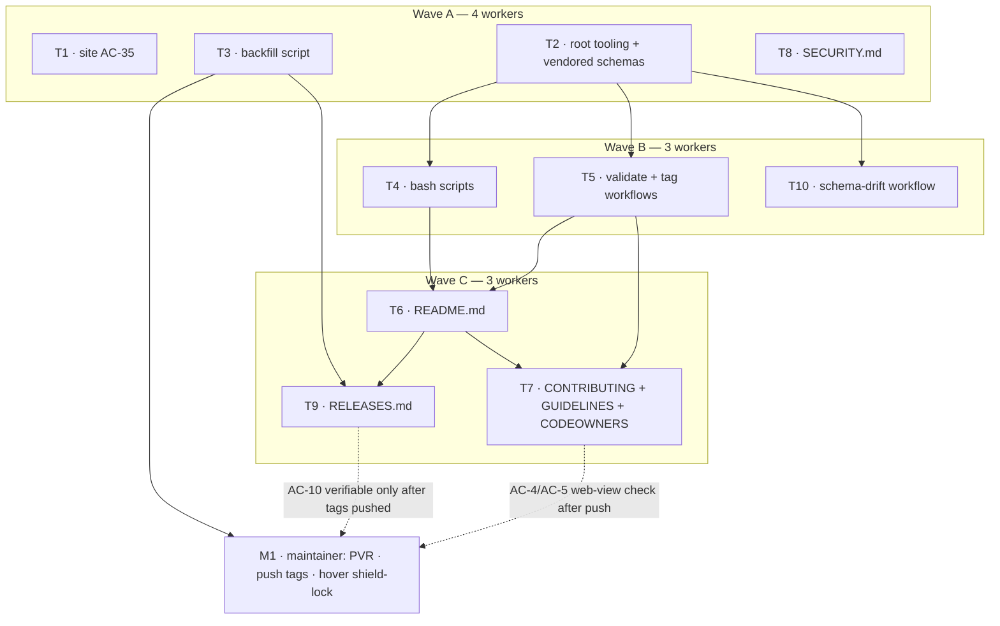

# PLAN-02 — Governance documents, marketplace CI validation, and an authoritative release-tag invariant

- **Plan ID:** PLAN-02   **Spec:** [`specs/repo/SPEC-02-2026-07-16-governance-docs-ci-and-release-tagging.md`](../specs/repo/SPEC-02-2026-07-16-governance-docs-ci-and-release-tagging.md) (`approved`, AC-1…AC-40)
- **Date:** 2026-07-16   **Module:** `repo`   **Owner:** RostK
- **Execution mode:** multi-agent, 10 task units across 3 waves, max concurrency 4
- **Status:** awaiting plan approval

> **Naming.** `PLAN-02` pairs with `SPEC-02`, following this repo's existing precedent
> (`plans/PLAN-01-lexical-search-and-keyword-index.md` ↔ `SPEC-01`).

---

## 1. Execution mode

**Multi-agent — 4 → 3 → 3 across three waves.**

The parallelism is **wave-gated, not free**. Almost everything depends on the tooling unit (T2), and the
governance documents must not contradict each other — AC-14 exists precisely *because* that
contradiction is live in the repo today. What genuinely parallelizes:

- `site/` (T1) is disjoint from everything.
- The three bash scripts are **one** unit, not three — they share `_common.sh`.
- `CONTRIBUTING.md` + `docs/PLUGIN-GUIDELINES.md` are **one** unit — both must name `plugin.json`
  authoritative (AC-29). Two agents writing them separately reproduces the AC-14 defect this spec exists
  to remove.

> **Worktree staleness — the single biggest execution risk.** The implementer self-isolates from an
> **old base commit**, so committing between waves does *not* let wave B see wave A. **Step 0 of every
> wave-B/C brief must explicitly sync to the integration branch**, or T4/T5/T10 will not see T2's
> `package.json` or `schemas/`.

Single-agent is a defensible fallback — the total is ~16 files — if you would rather not pay the
worktree-sync overhead.

## 2. Verification of the spec against the tree

Every load-bearing claim was re-verified rather than taken on faith. **All confirmed:**

| Claim | Verified |
|---|---|
| `scripts/release.sh:58` → `TAG="v$VERSION"` | ✅ exact, unconditional — Family-M grammar for a per-plugin event |
| `release.sh:67` guard checks only `refs/tags/$TAG` | ✅ cannot see `sdd-engineering--v1.1.1` |
| `release.sh:72-86` `--plugin` bumps only `plugin.json` | ✅ never touches `marketplace.json` |
| `scripts/_common.sh:68-73` fail-open | ✅ `command -v claude` else-branch warns and **falls off the end returning 0** |
| `site/scripts/build-index.mjs:105` | ✅ `manifest.version \|\| entry.version \|\| null` |
| No root `package.json` | ✅ `git ls-files '*package.json'` → `site/package.json` only |
| 4 annotated tags today | ✅ `git for-each-ref` → all `objecttype tag` |
| Backfill SHAs + manifest versions | ✅ all three resolve, declare the right version, `merge-base --is-ancestor <sha> main` → true |
| Seven released versions, no fourth surprise | ✅ independently re-enumerated via `git log --first-parent` per manifest |

### Three findings the spec does not record

- **`README.md:45-56` is already stale and contradicts the live catalog.** It documents
  `"source": "<name>"` relative to a `pluginRoot: "./plugins"`, and claims *"`marketplace.json` ships
  with an empty `plugins: []`"*. The real `.claude-plugin/marketplace.json:11` uses
  `"source": "./plugins/engineering-paved-path"` and has **no `pluginRoot` key**. This bites directly:
  **AC-33's containment rule must be written against the real repo-root-relative form**, and AC-6 must
  not copy README's stale shape into `PLUGIN-GUIDELINES.md`. → T6/T7.
- **`README.md:84` — *"Both scripts run `claude plugin validate .` first"* — becomes false the moment
  AC-21 lands.** Three doc sites, not one: `release.sh:26` and `rollback.sh:29` also promise it in their
  `--help`. → T4 (the two usage blocks) and T6 (README).
- **A near-miss cross-spec conflict, resolved: not a conflict.** `site/scripts/build-index.it.test.mjs:5`
  describes *"the AC-20 'never exit non-zero' guarantee"*, which reads as forbidding AC-35. It is not:
  SPEC-01's AC-20 is scoped strictly to **keyword staleness**. AC-35 fails on **version drift** — a
  different cause. The test comment over-generalizes its own AC. → pitfall on T1.

## 3. Decisions taken (maintainer-confirmed)

| # | Decision | Consequence |
|---|---|---|
| **D-a** | **Both tag writers, reconciled.** `release.sh` keeps tagging (AC-25); the CI job is **idempotent** and no-ops when the tag exists (AC-36). | Zero AC changes. See the A-P2 caveat in §4. |
| **D-b** | **Vendor the schemas.** Committed copies are the validation source; a scheduled job diffs them against upstream. | Spec amended: AC-15 rewritten, **AC-39** + **AC-40** added (§5.4, §14 AM-1). |
| **D-c** | **AC-27 means collision-warn.** A no-`--plugin` invocation whose `X.Y.Z` collides with a plugin's current version is a probable "you meant `--plugin`" → warn and confirm, never silently tag over. | AC-27 unchanged; T4 now has a definite meaning to design against. |
| **D-d** | **Root `package.json`** (R-1) — `private: true`, `type: "module"`, devDeps `ajv` + `ajv-formats`. | NF-4 decided it: hanging validation off `site/` would make every manifest-only PR pay a full vite+vitest+sharp+jsdom install. |
| **D-e** | **AC-4's verify amended** to the shield-lock tooltip (§14 AM-2). AC-5 confirmed correct, left byte-identical. | The requirement never changed — only its verification method. |

## 4. Assumptions

- **A-P1.** Family-M (`vX.Y.Z`) support stays in `release.sh` as the no-`--plugin` path. NG-12 forbids
  *cutting* the first Family-M tag, not implementing the grammar (AC-38 constrains it).
- **A-P2.** The AC-36 tagging job **must be idempotent**. Not optional polish: AC-25 keeps `release.sh`
  creating and pushing a Family-P tag, so a maintainer releasing via the script and pushing to `main`
  makes CI observe a version change whose tag **already exists**. A non-idempotent job turns the
  documented release path permanently red.
  > **⚠️ Accepted, eyes-open gap.** The maintainer declined to make idempotency an AC, so
  > **`plan-verifier`'s AC→test forward pass structurally cannot catch its absence** — AC-36's verify
  > passes for a naive react-to-diff job *and* an idempotent one; they are indistinguishable on the
  > happy path. **T5's definition-of-done is the only enforcement surface.** Review it by hand; do not
  > trust the AC trace here.
- **A-P3.** Tag creation/pushing for AC-23 is a **maintainer act**. Implementers author and dry-run;
  the maintainer runs and pushes (project convention: no auto-commit).
- **A-P4.** `git tag` from an implementer's worktree writes to the **shared** ref store — worktrees share
  `.git`. No implementer may run the backfill for real. Dry-run only. (Reinforces A-P3.)
- **A-P5.** Node 20 (matching both existing workflows) has global `fetch` — T10's drift job needs no HTTP
  dependency.
- **A-P6 (empirically verified, 2026-07-16).** Plain `new Ajv()` (v8.20.0, `strict: true` default)
  **compiles both schemas without throwing**, and the live catalog **validates cleanly: 5/5 files pass,
  0 external `$ref`s**. Run against the real upstream documents, not inferred. This closes the planner's
  "ajv may throw on unknown keywords" risk and turns AC-39's *"this gate does not land red on the tree it
  is introduced to"* from a claim into a measurement.

## 5. Recommendations adopted

- **R-1 → D-d.** Root `package.json`. *Ownership follows the artifact*: the things validated are
  repo-root artifacts; `site/` is a **consumer** of the catalog (`build-index.mjs:97` reads it), and
  putting the catalog's validator inside its consumer inverts the dependency. Rejected: a `tools/`
  workspace (npm workspaces need a root `package.json` anyway, for exactly one consumer); bare
  `npx ajv-cli` (pins nothing — against NF-3/UT-5). Accepted cost: a second lockfile — harmless, since
  both existing workflows already pass an explicit `cache-dependency-path: site/package-lock.json`.
- **R-2 (PI-13-lite) — effectively mandatory, see A-P2.** Make the AC-36 job *ensure-tag-exists* rather
  than *react-to-diff*.
- **R-3 (PI-14).** Assert AC-22 in CI — walk each manifest's first-parent history, fail if a released
  version lacks its tag. **T3 has to write that enumeration anyway** for the backfill, so the marginal
  cost is a workflow step. The entire §1.3 backfill exists because no such check did.
- **R-4.** Root `vitest` for the *pure* rule functions (AC-33 containment, AC-34 duplicate detection).
  This is merge-gating code, and AC-21 is itself the story of an untested gate silently failing open.
- **R-5 (PI-7).** The path-filter glob list will now exist in **three** workflows and gains a fifth glob
  (`schemas/**`). Actions YAML cannot DRY this — add a cross-reference comment in each.
- **R-6 (PI-5) — now covers TWO workflows.** SHA-pin the actions in **both** `tag-on-merge.yml` (T5) and
  `schema-drift.yml` (T10). Leave `@v4`/`@v5` elsewhere per NF-3. **Additionally: do not use
  `peter-evans/create-pull-request`** for AC-40's PR — that puts a third-party action (UT-5) inside a job
  holding `contents: write` + `pull-requests: write`, the highest-privilege/lowest-scrutiny combination in
  the repo. Use `gh pr create` (preinstalled on GitHub-hosted runners), so `schema-drift.yml`'s only
  action is `actions/checkout`.
- **R-7 (PI-9).** `scripts/` has no `LEARNINGS.md`. The fail-open `validate_marketplace()` is worth one
  note — it is exactly the security skill's **A10 fail-closed** violation and would be easy to reintroduce.
- **R-8 — withdrawn.** Its stated ground (unknown `additionalProperties`) is closed: confirmed absent at
  the marketplace root, the `plugins[]` item object, and the plugin-manifest root. PI-12 stays unadopted
  for a *different* reason — see §11.

## 6. Task units

**Tracks are labelled honestly.** This spec is repo tooling, CI, and prose. The `backend|ui` split does
**not** apply — there is no server ring and no React component or hook in scope; `build-index.mjs` is a
Node build script, not UI. Therefore **neither** `onion-architecture` **nor** `frontend-ui-architecture`
was invoked. `engineering-paved-path:security` **is** triggered (untrusted fork input UT-1/UT-2/UT-3, two
`contents: write` grants, and a fail-open gate) and is quoted on the units below.

---

### [T1] Close the last silent-drift path in the site indexer · track: site · wave A

- **Files:** `site/scripts/build-index.mjs` (modify line 105); `site/scripts/build-index.it.test.mjs`
  (add a drift case).
- **Skills:** `engineering-paved-path:typescript-expert`, `engineering-paved-path:react-testing-library`
  (vitest idiom only — no components here).
- **Pitfalls:**
  - **The AC-20 trap.** `build-index.it.test.mjs:5`'s *"AC-20 'never exit non-zero' guarantee"* comment
    **does not forbid AC-35** — SPEC-01's AC-20 covers **only** keyword staleness. Version drift is a
    different cause and **may** fail. Do not soften AC-35 into a warning because of that comment.
  - *"`src/catalog.json` is generated and gitignored … a bad catalog is a build failure, not a runtime
    one"* — `site/LEARNINGS.md`. Supports failing hard.
  - **Shebang/CRLF:** `build-index.mjs:1` **has** a shebang and is `spawnSync`'d, not imported — keep it
    that way. Any helper you extract gets **no shebang** (`site/LEARNINGS.md`; `.gitattributes:4-5`
    already pins `*.mjs` to LF).
  - The IT test runs against the **real repo**. A drift fixture must mutate `.claude-plugin/marketplace.json`
    and restore it — mirror the `KEYWORDS_BACKUP_PATH` backup/restore idiom (`build-index.it.test.mjs:17-18`)
    and restore in `afterAll` **even on failure**, or you leave the root catalog dirty.
- **DoD:** with `plugin.json` and the marketplace entry disagreeing, the indexer fails (or reports drift)
  naming both values; `cd site && npm test` green (the 29-artifact assertion at `:27` must still hold).
- **Depends on:** none.

### [T2] Root tooling + vendored schemas · track: repo-tooling · wave A

**Vendoring is not separable from T2.** The vendoring script and AC-40's drift script are **the same
script with two modes** — `--check` (fetch, diff against committed, non-zero on drift = AC-40) vs
`--write` (fetch, overwrite, restamp provenance = initial vendoring + the drift PR's payload). Splitting
them puts one file's logic in two units and hands T10 a shared file. And T2's DoD ("validator green on a
clean tree") is unreachable without the schemas present, so a separate vendoring unit would push T2 out
of wave A and cost a whole wave for two JSON files.

- **Files:**
  - `package.json` — create (root): `private: true`, `type: "module"`; devDeps **`ajv` + `ajv-formats`**;
    optional `vitest` (R-4); scripts `validate:manifests`, `gen:marketplace`, `check:marketplace`,
    `schemas:check`, `schemas:update`.
  - `package-lock.json` — create (committed).
  - `.gitignore` — modify: root `node_modules/`.
  - `schemas/claude-code-marketplace.json`, `schemas/claude-code-plugin-manifest.json` — create:
    **byte-exact upstream copies** (AC-39).
  - `schemas/provenance.json` — create: per-file `{ url, vendoredAt, sha256 }` (AC-39).
  - `schemas/README.md` — create: the do-not-hand-edit rule (§11).
  - `scripts/vendor-schemas.mjs` — create: `--check` / `--write` (AC-39 + AC-40's engine).
  - `scripts/validate-manifests.mjs` — create: AC-15, AC-16, AC-33, AC-34.
  - `scripts/gen-marketplace-versions.mjs` — create: AC-18.
  - `scripts/*.test.mjs` — create (R-4, if accepted).
- **Schema location — `schemas/` at repo root:** not `.claude-plugin/schemas/` (that directory is the
  catalog root Claude Code itself reads; foreign files there risk confusing plugin tooling and would drag
  every schema change through three `plugins/**` path filters, triggering the site build and a Pages
  deploy for a schema bump); not `.github/schemas/` (these are not CI config — the validator runs locally
  too, and AC-21 now routes `release.sh` through it); not `scripts/schemas/` (they are data *consumed by*
  scripts, and AC-40 *writes* them). `schemas/` matches the repo's flat single-purpose top-level
  convention and sits outside every existing workflow path filter.
- **Skills:** `engineering-paved-path:typescript-expert`, `engineering-paved-path:security`,
  `engineering-paved-path:zod` *(named for contract-shape reasoning only — **do not add Zod**; ajv is the
  AC-15 validator)*.
- **Pitfalls:**
  - **🔴 Never fabricate a schema.** The vendored copies must be **byte-exact fetched artifacts**. With no
    network access, **stop and hand off** — do not reconstruct a schema from this plan's research summary.
    A hand-written approximation would be permanently forked from upstream, AC-40 would report drift
    forever, and the gate would enforce a fiction.
  - **🔴 Provenance goes in the sidecar, NOT inside the schema JSON.** Adding `x-vendored-from` or a header
    comment **breaks AC-40 by construction** — the copy stops being byte-identical, so every drift check
    diffs forever. `schemas/provenance.json` exists precisely so the copies stay pristine.
  - **AC-33 is a path-traversal check** — the security skill's exact pattern: *"Validate `path.resolve()`
    starts with upload directory before deletion"*. `source` is attacker-controlled on a fork PR (UT-3).
    Resolve → assert inside the repo root → assert `.claude-plugin/plugin.json` exists. Reject absolute
    paths and symlinks (`realpathSync` + prefix check **with a trailing separator** — `/repo/plugins-evil`
    must not pass a naive `startsWith('/repo/plugins')`).
  - **Match the real `source` shape, not README's.** Live entries are `"./plugins/<name>"` with no
    `pluginRoot`. `build-index.mjs:100` does `resolve(REPO_ROOT, entry.source)` — **match that resolution
    base exactly**, or the indexer and validator will disagree about what `source` means.
  - *"`JSON.parse()` throws on malformed input — always wrap in try-catch"* (security skill) — a syntax
    error must surface as AC-16's named-file error, not an unhandled stack trace.
  - *"Prototype pollution via `__proto__`/`constructor.prototype`"* — a manifest is untrusted JSON; don't
    spread it into an object used for lookup.
  - **Generator must be byte-stable.** AC-18's *"clean-tree run is a no-op (`git diff --exit-code`)"* is a
    hard test: preserve 2-space indent + trailing newline exactly. Versions already agree, so a correct
    generator produces **zero** diff right now.
  - **`ajv-formats` is required but changes nothing for today's catalog** — no live entry uses
    `homepage`/`url`/`registry`. Register it anyway (AC-15 is explicit). Without it ajv silently no-ops
    `format: "uri"` — a fail-open, this spec's signature bug (A10).
  - **`compile()`, never `compileAsync`** — no external `$ref` (verified). Make the vendor script assert
    this on `--write`, so a future upstream that adds a remote `$ref` fails loudly instead of silently
    vendoring an incomplete document.
  - **`displayName` is fine.** All four manifests use it; the plugin-manifest root has no
    `additionalProperties: false`, so an unknown key is untyped, not rejected. **Do not "fix" the
    manifests or the schema** because it is undocumented.
  - **Don't let AC-15's "no schemastore URL" audit strip useful logging.** `schemas/provenance.json`
    legitimately *contains* those URLs as data; logging them is a string, not a fetch. Prove AC-15 the
    real way — **run the validator with that host unreachable** — not with a grep a provenance string
    would false-positive.
- **DoD:**
  - `npm run validate:manifests` **exits 0 on the clean tree**. This is an **assertion, not a hope** —
    verified by execution (A-P6): 5/5 files pass. **A red run on an unmodified tree means the validator is
    wrong, not the catalog.**
  - Log names both **committed schema paths** and all four manifests; the run completes with
    `json.schemastore.org` unreachable.
  - AC-16/AC-33/AC-34 scratch mutations each exit non-zero naming file + pointer.
  - `npm run gen:marketplace` is a byte no-op (`git diff --exit-code`).
  - `npm run schemas:check` exits 0 against freshly-vendored copies; non-zero naming the file when one is
    mutated.
  - `schemas/*.json` each declare `"$schema": "http://json-schema.org/draft-07/schema#"` and contain no
    `://` in any `$ref` (AC-39).
- **Depends on:** none. **Ungated.**

### [T3] Backfill the three historical tags · track: release-eng · wave A

- **Files:** `scripts/backfill-tags.sh` — create: **dry-run by default**, `--apply` to act, idempotent,
  **never pushes**.
- **Skills:** `engineering-paved-path:security`.
- **Pitfalls:**
  - **🔴 The tag targets are NOT the first-parent commits.** `git log --first-parent main` yields the
    **merge** commits `c143d3c` / `a779183` / `8ee05aa`, whereas AC-23 tags the **authoring** commits
    `4f56941` / `9bae60a` / `1cf5ea9`. Both satisfy AC-22 (which requires only *reachability*), and the
    asymmetry is deliberate. **Consequence for the AC-22 checker:** use first-parent to enumerate *which
    versions shipped*, then assert a tag exists for each version and that **the tag's own commit**
    declares it. A naive `assert tag.commit == first_parent_commit` fails on all three backfilled tags —
    the easiest way to get this unit wrong.
  - **Tags are shared refs across worktrees** (A-P4) — **dry-run only**. Never `--apply`, never push.
  - EC-10: a mis-targeted backfill *permanently cements a false claim* (NG-4 forbids moving tags). The
    script must re-verify `git show <sha>:plugins/<name>/.claude-plugin/plugin.json` declares the expected
    version **before** creating each tag, and abort otherwise. All three do today.
  - `git tag -a` — annotated (AC-24), never a lightweight ref.
  - Hostile `name` → ref injection (UT-3): pass refs as argv, never build a shell string (security skill:
    *"Use `execFile()` which passes arguments directly without shell interpretation"*).
- **DoD:** dry-run prints exactly the three `git tag -a` commands with the AC-23 SHAs and refuses any whose
  manifest disagrees; re-running after apply is a clean no-op. **Maintainer** applies + pushes; then
  `git tag -l` = 7.
- **Depends on:** none. *(Sources `_common.sh` for `log`/`die`/`run`/`confirm` but must **not edit it** —
  that is what keeps it disjoint from T4.)*

### [T8] `SECURITY.md` · track: docs · wave A

- **Files:** `SECURITY.md` — create.
- **Skills:** `engineering-paved-path:security`.
- **Pitfalls:**
  - **AC-8a is a text constraint with a mechanical test** — no `/within\s+\d+\s+(hour|day|week|business)/i`
    in a triage sentence. *"We aim to respond quickly"* is fine; *"within 48 hours"* fails. AC-31's
    supported-version policy is **not** a timing claim and is unaffected.
  - **AC-8 forbids naming `rkaniuchenko@gmail.com`** as an intake path — even though it is the
    `owner.email` in `marketplace.json:5`. PVR is the **sole** channel.
  - AC-31: naming `engineering-paved-path` as a dependency of two plugins is allowed **as context only** —
    it must not read as widening the support window.
  - AC-9 must name the concrete surface: `sdd-engineering` ships a real `SubagentStop`/`Stop` telemetry
    hook (NF-2). Don't write it as hypothetical.
  - AC-12: English. **AC-32 (enabling PVR) is M1's** — the document is *inert* until it is done.
- **DoD:** AC-8, AC-8a, AC-9, AC-31, AC-12 reviewable-true; the AC-8a regex finds no match.
- **Depends on:** none.

---

### [T4] Fix the release/rollback scripts · track: release-eng · wave B

- **Files:** `scripts/_common.sh` (modify `validate_marketplace()` :63-74; add tag-grammar helpers);
  `scripts/release.sh` (modify `:58` TAG, `:67` guard, `:26` help, `--plugin` path :72-86);
  `scripts/rollback.sh` (AC-28 resolution, `:29` help, `:13`/`:32-33` examples).
- **Skills:** `engineering-paved-path:security`.
- **Pitfalls:**
  - **This unit is the security skill's A10 verbatim.** *"Fail-closed: Errors must deny access, not grant
    it"* / *"Missing `return` before error response = fail-open vulnerability."* `_common.sh:68-73` is
    textbook: no `claude` → the `else` branch warns and **the function falls off the end returning 0** —
    `release.sh:88` then proceeds straight to tagging. AC-21 requires hard-fail; `SKIP_VALIDATE=1`
    (`:64-67`) stays the **only** opt-out.
  - **AC-21's verify says non-zero "before any tagging step"** — but `validate_marketplace` is called at
    `release.sh:88`, *after* the `--plugin` bump has written `plugin.json` and `git add`ed it (`:81-84`).
    A hard-fail there leaves a **dirty tree with a bumped manifest**. Either validate before the bump, or
    clean up on failure. Don't leave the maintainer half-bumped.
  - **All three files claim `claude plugin validate .`** — `release.sh:26`, `rollback.sh:29`, and
    `README.md:84` (T6's). The two `--help` blocks are in **this unit's** files.
  - `release.sh:67`'s guard must check the family **being cut** (AC-26), not always `v$VERSION`.
  - AC-38: the no-`--plugin` path may still cut Family-M — **do not delete it** (NG-12 forbids *cutting*
    the first one, not implementing the grammar).
  - **AC-27 = D-c:** collision-warn-and-confirm. Never silently tag over.
  - Ref injection via plugin `name` (UT-3): argv, never a shell-interpolated string.
  - `jq` is already a fatal dependency (`release.sh:75`; EC-9) — the AC-18 generator now adds **node** to
    the same path. Document both.
- **DoD:** AC-25's dry-run prints `sdd-engineering--v1.2.0`; AC-26 refuses post-backfill; AC-21's
  no-validator case exits non-zero **with a clean tree**; `rollback.sh sdd-engineering--v1.0.0 --dry-run`
  resolves; both `--help` blocks no longer promise the `claude` CLI.
- **Depends on:** T2.

### [T5] Validation + tagging workflows · track: ci · wave B

- **Files:** `.github/workflows/marketplace-validate.yml` — create (AC-15/16/19/20/30/33/34);
  `.github/workflows/tag-on-merge.yml` — create (AC-36/24/37).
- **Skills:** `engineering-paved-path:security`.
- **Pitfalls:**
  - **Two workflows, not one, deliberately.** Splitting keeps the write grant in a file a fork PR's
    `pull_request` event never instantiates (EC-6), and makes AC-19 trivially verifiable. Follows
    `site-build.yml`'s stated precedent: *"Deliberately SEPARATE … so on a PR you get a distinct status"*
    (`site-build.yml:3-6`).
  - **AC-15's job makes NO network call to schemastore.** It reads `schemas/*.json` off the checkout. No
    `curl`, no `fetch`. The vendoring fetch lives **only** in T10's scheduled job. Adding network egress
    here re-introduces exactly what AM-1 removed.
  - **New path-filter input:** a change to `schemas/**` changes what the gate enforces, so
    `marketplace-validate.yml` must trigger on `schemas/**` **in addition to** the four existing globs —
    otherwise T10's drift PR merges **with the validation check not running at all**. (This extends R-5's
    drift problem to a fifth glob in a third file; keep the cross-reference comment.)
  - **AC-20 / UT-2 — script injection.** Never interpolate `github.event.pull_request.title`/`.body`/
    `.head_ref` into `run:`. Pass through `env:` and quote, or don't touch them.
  - **AC-37 + EC-6:** the tagging workflow triggers on `push` to `main` **only**. Never
    `pull_request_target`. Top-level `permissions: contents: read`; the tagging job overrides to
    `contents: write`.
  - **NF-4 — do not `npm ci` in `site/`.** Install the **root** package;
    `cache-dependency-path: package-lock.json`.
  - `fetch-depth`: the validate job needs no history (**leave the default 1**, NF-4); R-3's AC-22 walk
    **does** need `fetch-depth: 0`.
  - AC-30 = `npm run gen:marketplace && git diff --exit-code -- .claude-plugin/marketplace.json`; the
    failure message must name **both** paths + the diff.
  - R-6: SHA-pin the tagging workflow's actions.
- **DoD:**
  - **🔴 The tagging job is idempotent** — create-if-absent, no-op-if-exists, never fail-on-exists (A-P2 /
    R-2). **This DoD line is idempotency's only enforcement surface** — no AC covers it. Prove it: run the
    tag logic twice against the same commit; the second run exits 0 having done nothing.
  - A PR touching `plugins/**` shows a check distinct from `Site build / build` whose log names both
    committed schema paths + 4 manifests; AC-15's job passes with `json.schemastore.org` unreachable.
  - `permissions:` audit passes AC-19/AC-37; a bump-only PR fails AC-30 and passes after regenerating.
- **Depends on:** T2.

### [T10] Scheduled schema-drift workflow · track: ci · wave B

**A third workflow file, and its own unit.** Not in `marketplace-validate.yml`: AC-19 scopes *the
validation workflow* to `contents: read`, and a job-scoped write there would put a privileged job in the
one file a fork's `pull_request` instantiates (EC-6/UT-2). Not in `tag-on-merge.yml`: its `on:` would gain
`schedule`, its name would lie, and it would carry two privileged jobs with unrelated triggers. Its own
file makes AC-19, AC-37, and AC-40 each verifiable by reading one file — and isolates the repo's **second**
privileged job into its own reviewable unit.

- **Files:** `.github/workflows/schema-drift.yml` — create (AC-40, **AC-41**).
- **Skills:** `engineering-paved-path:security`.
- **Pitfalls:**
  - **🔴 A PR opened by `GITHUB_TOKEN` does not trigger `pull_request` workflows** — so AC-40's drift PR
    arrives with **zero status checks**, meaning the highest-risk PR in this repo (UT-6: a changed,
    possibly hostile, third-party schema that *is* the merge gate) would merge with no CI proving the new
    schema still accepts the live catalog. **This is now AC-41, not a plan-level hope:** the drift job must
    run the AC-15 validation against the **candidate** schema before opening the PR and state the verdict
    in the PR body — so "here is a diff" becomes "here is a diff, and here is whether it would break us."
  - **AC-41's verdict informs; it never blocks.** A negative verdict must still open the PR and the job
    must still succeed — the maintainer decides. Gating here would re-import the merge-path coupling that
    AM-1 removed (EC-8).
  - **🟠 A positive AC-41 verdict is NOT a judgement that the candidate is benign.** A hostile schema that
    admits everything passes AC-41 cleanly. AC-41 answers one question only — *would this candidate still
    accept our catalog* — and **reading the diff remains the actual control** (UT-6). Do not let the PR
    body's wording imply review-is-done.
  - **AC-40 is non-gating by construction** — never `pull_request`/`pull_request_target`, never a status
    check on a catalog PR. That non-gating property is the entire point of vendoring (EC-8). Do not add it
    to any required-check list.
  - **UT-5/R-6:** SHA-pin `actions/checkout`; use **`gh pr create`**, not a third-party PR action, inside a
    job holding two write scopes.
  - **UT-6 — the fetched schema is untrusted input.** It is fetched, written to disk, and proposed for
    merge. Parse and sanity-check before committing (valid JSON; declares draft-07; no `://` in any
    `$ref`); never `eval`; never let it choose the write path (traversal via a filename derived from remote
    content). The upstream schema body is the untrusted string here — never interpolate it into a `run:`.
- **DoD:** `on:` = `schedule` + `workflow_dispatch`, no PR triggers; top-level
  `permissions: contents: read`; exactly one job with job-scoped write; a `workflow_dispatch` run with a
  locally-mutated vendored copy surfaces the drift naming the file; a PR touching `plugins/**` shows the
  AC-15 check and **not** this job; **a `workflow_dispatch` run against a deliberately-broken candidate
  opens the PR anyway, carries a negative verdict in the body, and the job still exits 0 (AC-41).**
- **Depends on:** T2.

---

### [T6] `README.md` — the normative home for both tag grammars · track: docs · wave C

- **Files:** `README.md` — modify § "Release & rollback" (`:66-86`), § Notes (`:88-93`), § "Add your first
  plugin" (`:45-56`), + links (AC-13).
- **Skills:** none beyond repo convention (prose).
- **Pitfalls:**
  - **AC-14/AC-17 make this file the single normative location** for both grammars — every other doc
    **links** here rather than restating.
  - `README.md:68` states only Model B (*"each release is an annotated tag `vX.Y.Z`"*) and `:81` shows
    `scripts/rollback.sh v1.0.0` — **a tag that does not exist** (the 4 real tags are all Family-P). AC-28
    requires a real example.
  - `README.md:84` — *"Both scripts run `claude plugin validate .` first"* — **false after T4**.
  - **`README.md:45-56` is stale in a way that propagates:** `"source": "<name>"` + `pluginRoot`, *"ships
    with an empty `plugins: []`"*, *"`example-plugin` folders are placeholders"*. The live file uses
    `"./plugins/<name>"`, has no `pluginRoot`, and lists four plugins. AC-6 tells `PLUGIN-GUIDELINES.md` to
    match *"the layout … `README.md` § Structure"* — **fix the source before T7 cites it.**
    **Coordinate: T6 and T7 must agree on the `source` shape.**
  - AC-29: name `plugin.json` authoritative; never instruct a `marketplace.json` version hand-edit (AC-18).
- **DoD:** AC-13, AC-14, AC-17, AC-28, AC-29, AC-38 hold; the rollback example names an existing tag; no
  `claude plugin validate` claim survives that T4 falsified.
- **Depends on:** T4, T5.

### [T7] `CONTRIBUTING.md` + `docs/PLUGIN-GUIDELINES.md` + `CODEOWNERS` · track: docs · wave C

- **Files:** `CONTRIBUTING.md` — create (AC-1/2/3); `docs/PLUGIN-GUIDELINES.md` — create (AC-6/7);
  `.github/CODEOWNERS` — create (AC-4/5).
- **Skills:** none beyond repo convention (prose).
- **Pitfalls:**
  - **These two documents are one unit on purpose.** Both must name `plugin.json` authoritative (AC-29) and
    state the AC-18 "bump `plugin.json` only" rule. Split across two agents, they drift — the AC-14 defect
    this spec exists to remove.
  - **AC-2 vs AC-21 is a tension, not a contradiction.** AC-2 requires the three `claude …` commands
    **verbatim** (`README.md:61-63`), while AC-21 removes the `claude` CLI from the scripts and AC-15 bans
    it from CI. Frame it correctly: the `claude` CLI is the **contributor's local** loop; **ajv** is the CI
    gate. Do not "resolve" the tension by dropping either.
  - **AC-2 needs T5/T10's real job names** — *"the named checks match the job names in
    `.github/workflows/*.yml`"*. Read them, don't guess.
  - **AC-4 is exact:** the file's *entire* content is the blanket rule — **exactly one** non-comment line,
    `* @RostK`. Comments permitted; a second rule is not.
  - **AC-4/AC-5 are now verifiable without a PR and without branch protection** (AM-2). AC-4 — GitHub web
    file view of any tracked file → hover the shield-lock icon → `Owned by @RostK (from CODEOWNERS line N)`.
    AC-5 — GitHub validates CODEOWNERS syntax on the file's own web view, independent of branch protection
    and of any PR; local half: `git ls-files` non-empty for the blanket pattern.
  - **A-8 is an assumption, not a guarantee** — CODEOWNERS on a personal (non-org) repo is *undocumented*,
    not *unsupported*. If the shield-lock tooltip does **not** appear once the file lands, that
    **falsifies A-8** — a spec-level finding to report upward, **not** an implementation bug to debug.
  - AC-6's field list must be **as actually used by all four manifests** — verify against the files, not
    README's example (which shows only 3 fields at `:28-32`).
  - AC-7: the real dependency edges are at `marketplace.json:26-28,35-39`. EC-3 (unsatisfiable range) is
    **documented, not enforced** (PI-4 not adopted) — say so honestly.
  - Use the **real** `source` shape (`./plugins/<name>`) — coordinate with T6.
  - AC-12: English. **NG-10: no `LICENSE` mention** — do not "helpfully" add one.
- **DoD:** AC-1, AC-2, AC-3, AC-4, AC-5, AC-6, AC-7, AC-12 hold; all four manifests conform to the
  documented field list; no statement contradicts T6's README.
- **Depends on:** T4, T5, T6.

### [T9] `RELEASES.md` · track: docs · wave C

- **Files:** `RELEASES.md` — create.
- **Skills:** none beyond repo convention (prose).
- **Pitfalls:**
  - **AC-11 is an exact-set assertion — all seven, no more, no fewer:** `engineering-paved-path` 1.0.0;
    `research-tools` 1.0.0; `architecture-review` 1.0.0 + 1.1.0; `sdd-engineering` 1.0.0 + **1.1.0** +
    1.1.1. **`sdd-engineering` 1.1.0 is the easy one to drop** — it was superseded and is absent from the
    original brief. It **must** be present and **marked superseded by 1.1.1**.
  - Ship-before-tag must be noted for **all three**: `architecture-review` 1.1.0, `sdd-engineering` 1.1.0,
    `sdd-engineering` 1.1.1.
  - **AC-10 is bidirectional:** every Family-P tag has an entry, **and** every entry names a tag that
    exists. Until the maintainer applies T3, only 4 tags exist — so this AC is fully verifiable **only
    after the backfill is pushed**. Flag it at the gate; don't fake it.
  - Hand-written prose, Keep a Changelog, one top-level section per plugin. *Generated commit dumps do not
    satisfy this AC.*
  - AC-14: **link** to README's grammar; do not restate it. AC-12: English.
- **DoD:** exactly seven versions; superseded marker on `sdd-engineering` 1.1.0; ship-before-tag noted ×3;
  Keep a Changelog declared; one section per catalog plugin.
- **Depends on:** T3 (tag names), T6 (grammar link).

---

### [M1] Maintainer actions — not deliverable by any commit

- **AC-32** — enable Private Vulnerability Reporting (Settings → Security). **T8's `SECURITY.md` is inert
  until this is done.**
- **AC-23** — run `scripts/backfill-tags.sh --apply` and push the three tags (A-P3/A-P4). `git tag -l`
  4 → 7.
- **AC-4/AC-5** — open any file in the web view and hover the shield-lock (seconds; no PR, no branch
  protection). Needs the branch pushed, which is why it stays here.

## 7. Parallelization graph

**Disjointness audit:**

- **Wave A (4):** `site/scripts/**` (T1) | `package.json` + `package-lock.json` + `.gitignore` +
  `scripts/*.mjs` + `schemas/**` (T2) | `scripts/backfill-tags.sh` (T3) | `SECURITY.md` (T8). **No
  overlap.** T2 and T3 both live under `scripts/` but touch **disjoint files** (`*.mjs` vs
  `backfill-tags.sh`); T3 only *sources* `_common.sh` and must not edit it.
- **Wave B (3):** `scripts/*.sh` (T4) | `marketplace-validate.yml` + `tag-on-merge.yml` (T5) |
  `schema-drift.yml` (T10). **No overlap.**
- **Wave C (3):** `README.md` (T6) | `CONTRIBUTING.md` + `docs/` + `.github/CODEOWNERS` (T7) |
  `RELEASES.md` (T9). **No overlap**, but all three are prose bound by AC-14 — each brief must carry the
  **same** normative-facts block (both grammars, `plugin.json` authoritative, the real `source` shape)
  copied from T6's finished README.

Max concurrency **4**. **Every wave-B/C brief needs an explicit step 0 sync** to the integration branch —
the implementer worktree branches from a stale base and will not otherwise see T2's `package.json` **or
`schemas/`**.

## 8. AC → unit coverage

| AC | Unit | | AC | Unit |
|---|---|---|---|---|
| AC-1, AC-2, AC-3 | T7 | | AC-21 | T4 |
| AC-4, AC-5 | T7 (+M1 confirm) | | AC-22 | T3 (+R-3/T5) |
| AC-6, AC-7 | T7 | | AC-23 | T3 (+M1 apply) |
| AC-8, AC-8a, AC-9 | T8 | | AC-24 | T3, T4, T5 |
| AC-10, AC-11 | T9 | | AC-25, AC-26, AC-27 | T4 |
| AC-12 | T7, T8, T9 | | AC-28 | T4 + T6 |
| AC-13 | T6 | | AC-29 | T6 + T7 |
| AC-14 | T6 (normative), T7/T9 (link) | | AC-30 | T2 + T5 |
| **AC-15** *(rewritten)* | T2 + T5 | | AC-31 | T8 |
| AC-16 | T2 | | AC-32 | **M1** |
| AC-17 | T4 + T6 | | AC-33, AC-34 | T2 |
| AC-18 | T2 (+T4, T7) | | AC-35 | T1 |
| AC-19, AC-20 | T5 | | AC-36, AC-37 | T5 |
| | | | AC-38 | T4 + T6 |
| | | | **AC-39** *(new)* | **T2** |
| | | | **AC-40** *(new)* | **T10** (engine in T2) |
| | | | **AC-41** *(new, AM-3)* | **T10** (validator from T2) |

Every AC (1–41, plus AC-8a) maps to ≥1 unit; every unit traces to ≥1 AC.

## 9. Non-functional requirements

- **NF-1 (security)** — validation workflow `contents: read`, no fork secrets → **T5** (AC-19, AC-20).
- **NF-1a (security, accepted exceptions)** — since AM-3, the spec's **exhaustive** enumeration of every
  write-scoped job. Two rows, and a closing rule that a third privileged job needs its own entry and is
  **not** covered by analogy:
  | Job | Scopes | Bound | Unit |
  |---|---|---|---|
  | Tagging (AC-36) | `contents: write` | job-scoped; `push` to `main` only; unreachable from a fork PR | **T5** |
  | Schema drift (AC-40/AC-41) | `contents: write` + `pull-requests: write` | job-scoped; `schedule` / `workflow_dispatch` only; no PR trigger | **T10** |
- **NF-2 (trust)** — `SECURITY.md` states the executable-artifact trust model → **T8** (AC-9).
- **NF-3 (supply chain)** — actions pinned as the repo already does; ajv + the two vendored schemas are
  themselves supply-chain inputs → **T5**, **T10**, **T2**. See R-6.
- **NF-4 (perf)** — validation must not become a second `site/` build. **This is what decided R-1.** →
  **T2**, **T5**.
- **NF-5 (i18n)** — English only (AC-12; project convention) → **T7, T8, T9**.
- **NF-6 (legal)** — MIT-without-LICENSE: **out of scope, no AC** (NG-10). No unit may add or imply a
  `LICENSE`.
- **NF-7 (a11y)** — n/a; AC-35 changes indexer behaviour, not rendering.

## 10. Scope

- **Touched:** repo root (`package.json`, `package-lock.json`, `.gitignore`, `CONTRIBUTING.md`,
  `SECURITY.md`, `RELEASES.md`, `README.md`), `.github/` (`CODEOWNERS`, 3 new workflows), `docs/`,
  `schemas/` (new), `scripts/`, `site/scripts/` (narrow — AC-35 only).
- **Deliberately NOT touched:** `.github/workflows/pages.yml`, `site-build.yml` (NG-1); `plugins/**`
  content (NG-3); `site/src/**`, site rendering/tests/dist budget (NG-1); any `LICENSE` (NG-10); existing
  tags (NG-4); `specs/INDEX.md` — **already carries the SPEC-02 row** (`specs/INDEX.md:12`), nothing to do.
- **Contracts changed:** `.claude-plugin/marketplace.json`'s `version` fields become **generated output**
  (AC-18). Not duplicated across vendored copies — `build-index.mjs:97` is the only other reader, and T1
  covers it.

## 11. Test plan

- **Existing, must still pass:** `cd site && npm ci && npm run build && npm test && npm run check:dist` —
  the exact chain `site-build.yml:50-60` runs. T1 is the only unit touching `site/`; the 29-artifact
  assertion (`build-index.it.test.mjs:27`) and the AC-20 keyword-staleness guards (`:123-133`) must stay
  green.
- **New — root (T2):** `npm run validate:manifests` (0 on clean tree — **asserted, verified by execution**);
  `npm run check:marketplace` (no-op diff); `npm run schemas:check` (0 on freshly vendored, non-zero +
  filename on a mutated copy); **`npm run validate:manifests` with schemastore DNS blocked → still 0**
  (AC-15's real no-fetch proof, not a grep). Unit tests for the AC-33/AC-34 rules if R-4 is accepted
  (vitest, **no shebang**).
- **New — scripts (T4):** dry-run assertions for AC-25/AC-26/AC-27/AC-28; a no-validator environment for
  AC-21 (assert non-zero **and** a clean tree).
- **New — CI (T5, T10):** AC-16/AC-30/AC-33/AC-34 are verified by **scratch-branch PRs**, per their own
  verify steps — they cannot be proven locally. Budget a throwaway branch; AC-16 requires at least one
  error class *the site build tolerates today* (e.g. deleting `owner.name`). T10: `workflow_dispatch` with
  a mutated vendored copy → drift surfaced; verify by inspection that no catalog PR shows the job.
- **New — invariant (T3, R-3):** the AC-22 first-parent walk. **Assert versions-have-tags, not
  tag == first-parent-commit** (see T3's first pitfall).

## 12. Risks & review gates

- **🔴 The drift PR arrives with zero status checks** — see §11 flag 1. Mitigation is folded into T10's
  pitfalls but is **not enforced by any AC**.
- **Hard to undo — AC-23's tags.** NG-4 forbids moving them; EC-10 is the permanent-false-claim case. All
  three SHAs re-verified; the **maintainer** applies and pushes (A-P3). **Human gate.**
- **Two `contents: write` jobs (NF-1a/AC-37 + AC-40).** Deliberate and accepted, but the highest-value
  targets in the codebase. Review both workflow files by hand for UT-2 injection sinks; SHA-pin both
  (R-6). **Human gate.**
- **Idempotency has no AC** (A-P2) — `plan-verifier` cannot catch its absence. **Review T5's DoD by hand.**
- **SchemaStore is a supply-chain input at vendor-update time** (EC-8/UT-6) — no longer in the merge path,
  which is the point of AM-1.
- **AC-10 cannot be fully verified until M1 pushes the tags.** T9 will look incomplete at the gate.
  Expected, not a defect.
- **A-8 (CODEOWNERS on a personal repo) is an assumption.** If the shield-lock tooltip never appears, that
  is a spec finding, not a bug.
- **Wave staleness** — the most likely execution failure is T4/T5/T10 not seeing T2's `package.json` or
  `schemas/`. **Step 0, every brief.**
- **AC-2's `claude`-CLI-vs-ajv tension** is the likeliest place a doc agent "helpfully" resolves a
  non-contradiction and breaks AC-2 or AC-15.

## 13. Planner flags — all four closed

Raised on the delta pass; every one is now resolved, three by spec amendment AM-3 and one by execution.

1. **✅ CLOSED by AM-3 → AC-41.** *"AC-40's drift PR will arrive with zero status checks."* A PR opened by
   `GITHUB_TOKEN` does not trigger `pull_request` workflows, so the AC-15 check would not run on the one PR
   that most needs it. AM-1 correctly moved third-party risk off the merge path onto the vendor-update
   path — but that path then had *less* automated scrutiny than the path it replaced. **AC-41 now requires**
   the drift job to validate the candidate schema and state the verdict in the PR body. It was added as a
   **new adjacent AC rather than folded into AC-40** — AC-40 tests *drift is surfaced non-gatingly*, AC-41
   tests *the surfaced diff carries a verdict*; folding them would make one AC with two testable claims,
   against the one-statement rubric, and would have invalidated this plan's existing AC-40 trace.
2. **✅ CLOSED by AM-3 → NF-1a.** Widened into an **exhaustive two-row table** (see §9) naming both jobs,
   both scope classes, and each bound — rather than adding an NF-1b, because an auditor who finds NF-1a and
   must *also know NF-1b exists* reproduces the exact failure the flag described. §11's "first
   `contents: write` grant" claim corrected.
3. **✅ CLOSED by execution, 2026-07-16.** *"Plain `new Ajv()` may be unsatisfiable against these schemas"*
   (ajv v8 defaults `strict: true` and throws on unknown keywords; SchemaStore documents often carry editor
   annotations). Run against the real upstream documents: `ajv@8.20.0`, plain `new Ajv()` + `ajv-formats`,
   `compile()` → **both schemas compile without throwing**; the live catalog **validates 5/5 clean**;
   **0 external `$ref`s**. AC-15 is literally satisfiable; no options object needed. (A-P6; D-1's
   reliability upgraded relayed → verified.)
4. **✅ CLOSED by AM-3 → AC-39.** The invariant is now explicit: copies stay **byte-identical to upstream**,
   provenance recorded **outside** them. The spec does not prescribe the file — `schemas/provenance.json`
   remains this plan's HOW.

**Recorded, not a flag:** PI-12 stays **unadopted**. A `$schema` key pointing at the *upstream* URL while CI
enforces the *vendored* copy means a contributor's editor and CI can disagree for the width of AC-40's drift
window. R-8's original ground is closed; this is the better reason.

**Two limits AM-3 recorded that no AC can remove:**
- **A positive AC-41 verdict is not a safety judgement.** A hostile schema that admits everything passes it
  cleanly. AC-41 answers *would this candidate still accept our catalog* — nothing more. **Reading the diff
  remains the control** (UT-6).
- **AC-41 measures the candidate against *this catalog*, not against what the `claude` CLI enforces.** The
  CI-vs-CLI divergence stays stated in EC-8 and is not settled by anything here. Relatedly, D-1's
  reliability is now **split**: the schema constraints are executed and High; the `claude` CLI half
  (onboarding/TTY/exit-code — which NG-11 and PI-10 rest on) is **still relayed-only and unverified**.

## 14. Handoff

Approve this plan, then run **`sdd-engineering:run-plan`** on it for build → review → fix → gate.

> **Before `plan-verifier` runs, the spec amendments must be committed.** They are currently uncommitted
> (`git status` → ` M specs/repo/SPEC-02-…md`); otherwise the verifier traces against the pre-amendment AC
> set and reports AC-39/AC-40 as inventions.
